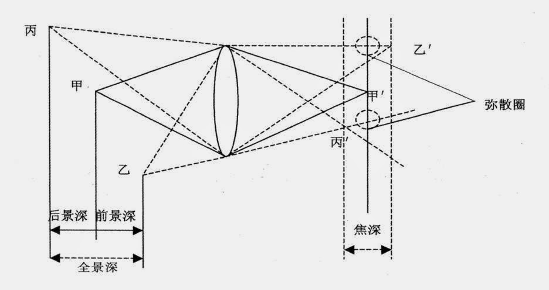

# 单反对焦学习

记下几个点，一边以后翻阅，没有先后的逻辑性，仅仅是一些零碎的知识点，极有可能是错的：

1\. accuracy：google翻译成准确性；precision：google翻译成精确性。这两者还是有点区别的，准确性高不一定精确性就高，反过来也成立。比如：测量n次某数据，最后得到取平均值如果和实际完全正确的话，叫做这个值准确，但是如果每次测量的数据值偏差都很大的话，那么每次测量的精确性就很低；如果每次测量的数值偏差都很小，那么精确度很高，但是取得的平均值和实际值偏差大的话，那么准确性小。但是也存在精确度差，准确度也差，或者准确度差，精确度也差；精确度高，准确度也高，准确度高，精确度也高。

2\. 先说对焦系统的准确性，对于F2.8的对焦模块（autofocus sensor，一块小的CCD）要求准确性很高，也就是尽量对焦点偏移量不超过焦深（Depth of Focus）的1/3（说法不一，有的资料1/2也行），这里注意焦深和景深(Depth of Field)的区别。景深是镜头前面实物清晰的距离，而焦深是实物在成像面清晰的距离。下图说明：

3\. F2.8的对焦准确性很高，但是佳能将af sensor像素密度增加一倍（这样对光线更加敏感）的情况下可以使得F4的对焦准确性和F2.8相同。大部分资料上都显示基线（baseline）影响对焦速度，按照这条理论，F2.8的af sensor对焦速度要比F4的慢，但是准确度要比F4高，可是佳能的做法（佳能已取得相关专利）使得F4不仅比F2.8对焦快，并却准确度能和F2.8一样高。

4\. 市面上F5.6是对焦准确度下下线，所以一些自动镜头的最大光圈要保证在F5.6，要不没法自动对焦了，只能手动对焦。所以宾得新生产的白大炮560mm F5.6加上倍增镜的话，只能手动对焦。

