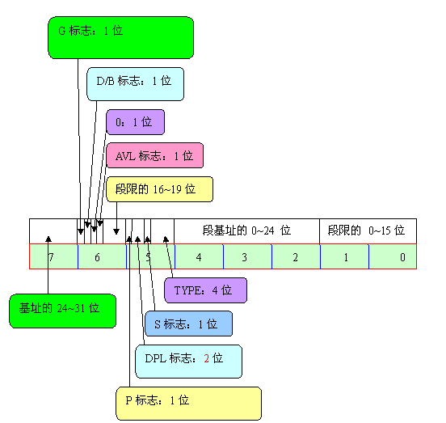

# 内核引导启动程序分析

整个内核引导程序有三个文件，分别是bootsect.s,setup.s,head.s，这三个文件是内核源代码中最先被编译的程序。这3个程序完成的主要功能是当计算机加电时引导内核启动，将内核代码加载到内存中，并作一些进入32位保护运行方式前的系统初始化工作。其中bootsect.s和setup.s程序需要使用as86软件来编译，使用的是as86的汇编语言格式，而head.s需要用GNU as来编译，使用的是AT&T格式的汇编语言。

Bootsect.s程序是磁盘引导块程序，编译后会驻留在磁盘的第一个扇区中，在PC加电ROM BIOS自检后，将被BIOS加载到内存0x7C00处进行执行。

Setup.s程序主要用于读取机器的硬件配置参数，并把内核模块system移动到适当的内存位置处。

Head.s程序会被编译连接在system模块的最前部分，主要进行硬件设备的探测设置和内存管理页面的初始化工作。

**Bootsect.s分析** 当按机箱上的power on的时候，cpu会自动去到bios中地址0xFFFF0处开始执行bios中的代码，除了会进行一些初始化工作，这段代码最主要的是将可启动设备的第一个扇区（bootsect.s）（引导扇区，512字节）读到内存0x07c00处。 当bootsect.s执行时，它已经被读到了0x07c00处，首先它会将自己读到0x90000处，由于bios被设置成了先读到0x7c00的地方，所以这里需要两步。然后再读到0x90000是为了防止后来读入到0x10000处的system模块覆盖掉bootsect.s。将自己读到0x90000处后先会设置一下堆栈（0x9000:0xff00），然后将setup.s读入到紧接着bootsect的地方（0x90200），默认的是从软盘读取的，然后就是取相应磁盘（被当作软盘，写成了hard code）的参数，然后就是利用bios的0x10中断，ah=0x03，将一段话"Loading system..."打印到屏幕上。然后检测要使用哪个根文件系统设备（软盘或者硬盘），具体的方法是判断508,509字节处的根设备号是否被置为1.这两个字节在编译内核的时候可以当作参数来设置，默认的是第二个硬盘。因为Linus当时在自己的机器上面有两个硬盘，而Linux的开发是在第二个硬盘上面进行的。 如果有硬盘的话，就将其参数保存，否则读取每磁道的扇区数来判断是什么类型的软盘(1.2M还是1.4M)，也保存其相应参数。 最后执行 jmpi 0,SETUPSEG，跳转到setup.s程序的开始处执行。  这样呢，bootsect.s就完成了自己的使命，其实最重要的就两点，第一个就是加载内核其它的模块，第二个就是将一些重要的参数保存下来，以供以后使用。 

**Setup.s分析**

    setup.s会将被bootsect.s读取到0x10000处的system模块移动到0x00000处，这样好象会把中断表给覆盖掉，文件执行到后来会加载中断描述符表，但是idt表却是这个样子的：

    idt\_48:

        .word 0

        .word 0,0

    idt表的基地址居然还是0x00000,这里就搞不懂了，因为这个时候0x00000的地方已经是system模块了，所以在真正的重新设置idt表以前，如果出现异常，这里不知道将会出现什么样的情况，这个是0.11设计的一个不足之处。

     setup.s会读取大量的参数然后存到0x90000处，也就是说会覆盖bootsect.s，具体的参数分布在《Linux内核完全分析》上有,系统会将第一个硬盘的参数表读到0x90080处，然后再读取第二个硬盘的参数表到0x90090处，然后再去检测到底有没有第二个硬盘，如果没有再将0x90090处的参数表清0，为什么不先检测有没有第二个硬盘，在去决定是否读取参数表到0x90090呢？非要反着来不成？这个也是0.11代码的一个不足之处，造成了次序颠倒。

     下面是关于80386保护模式的一些知识。

     在16位的实模式下的程序在内存中的布局和操作系统的是混在一起的，也就是说，cpu没有提供对操作系统的保护，这会出很多问题，32为保护模式下,cpu提供的很强大的功能来保护操作系统的代码不被侵犯，我们所要做的就是提供相应的数据，将相应的寄存器初始化，打开A20地址线，然后执行一个跳转指令，cpu就会进入保护模式，对我们的程序进行保护，具体的各位可以在网上找到资料，其中一个方法就是设置gdt以及ldt来保护操作系统以及应用程序，gdt(大小限制在64k以内)也即全局描述符表里包含有全局描述符，每个全局描述符得大小为8字节，所以理论上，一个gdt一共可以有64K/8=8K个全局描述符.其中三个是描述全局性的操作系统的代码段，数据段，其他的一个程序占用一个全局描述符.

    系统怎么来确定要使用哪一个全局描述符呢？使用段选择子！下图是段选择子的结构：

    其中3-15字节是用来索引gdt来去定某一个全局描述符得，共13位，所以gdt最大长度限制在2^13=64K.但是在这里Linus只将gdt的长度设置为了2K,也就是在

gdt\_48:

       .word 0x800  !这里是0x800,而不是0xFFFF，是因为现在的gdt是临时的，以后还有设置，所以只要够现在用就可以了

       .word 512+gdt,0x9   ! 这里由于setup.s是在0x90200处，所以要加上0x200（512）的偏移量。

     然后就是为系统进入32为保护模式作准备了，这里就要先初始化gdt,由于现在还没有程序运行，所以只是用了三项（其实是两项），其中，第零项没有使用，第一项描述系统的代码段，第二项描述系统的数据段（堆栈段）。

全局表述符表：

gdt:

      .word 0x0000                ！第0个弃用

      .word 0x0000

      .word 0x0000

      .word 0x0000

      .word 0x07FF                ！第1个，第0个用了4个word,所以这里偏移量是0x08

      .word 0x0000                ！用来描述系统代码段

      .word 0x9A00

      .word 0x00C0

      .word 0x07FF                ！第2个，偏移量是0x10，也就是16

      .word 0x0000                ！用来描述系统数据段

      .word 0x9200

      .word 0x00C0

    这里是gdt的结构：

     这时，进入保护模式所要准备的数据已经够了，接下来就是加载gdt的基地址以及大小限制到专用寄存器gdtr，idt基地址以及大小限制到idtr，然后打开A20数据线，关于A20数据线，哈工大纯c板块上有很好的文章介绍,然后重新对8259进行编程，设置状态字，然后执行jmpi 0,8    ！这里的8就是上面的段选择子的值，化为二进制为 0000,0000,0000,1000  这里的1就是第1个全局描述符，即系统代码段，就会去执行head.s

**head.s分析**

   head.s就运行在32位保护模式下面了，这里是名副其实的内核了. GNU的汇编直接数,比如 0x10，如果前面有$，即$0x10，则表示立即数，在16位实模式下，内存地址由段基地址左移四位加上段内偏移量组成，而在保护模式下，由段选择子（由段选择子选择的描述符所决定的段基地址不需要左移，直接加偏移地址就可以形成线性地址）和段内偏移量(逻辑地址)组成，这里是内存管理中的段式管理，还有页式管理，这里有张图片可以很好地说明段式管理：

  如果仅仅是0x10，则表示内存的地址。

  为什么既有段式内存管理，也有页式内存管理，大概是cpu设计的原因，如果cpu加电直接就可以进入32位，那么段式管理就应该报废了。

  head.s第18行，movl $0x10, %eax  之后eax就相当于段选择子，与gdt表的地址进行运算，就可以定为一个全局描述符，在全局表述符中会给出对应段的段基址，再加上已知的段内偏移量，就可以将一个逻辑地址转为一个线性地址，这里的0x10仅仅是段选择子。

  然后call setup\_idt, setup\_idt代码在79行，就是将idt中的每一项都设置为指向同一个中断门ignore\_int,即打印一段信息“Unknown interrupt”

  在这里说一下idt，idt就是中断描述符表，和全剧描述符表是一个等级的，相应的中断描述符表项和全局描述符表项是对应的，中断门ignore\_int是和全局描述符表项所表述的段一个等级的，只不过这里的不是一个段，而可以是一段代码

  接着call setup\_gdt,gdt在前面已经临时设置过了，在这里要重新设置.这里将gdt还是设置成为含有256个全局描述符表项，第0个不用，第一个系统代码段，第二个系统数据段，值分别是 0x00c09a0000000fff 0x00c09020000000fff，可以对照着本文第三张图来看看具体的意思。

  这里将系统代码段和系统数据段的段长都设置成为了16M.

  后面的252项都填充0，用于以后用户程序使用。接下来就是检查数学协处理器，还有287/387。然后就是开启分页管理。

  这里的分页机制是专门为内核使用的，也就是说以后的应用程序并不适用这里的页表，而是在程序执行的时候自己自动加载自己的页表。

  在这里所映射的16M内存其中前1M是专给内核来使用的，应用程序可以通过自己的页表来使用其余的15M,当然，内核也可以使用这15M的空间。

  这里的分页比较简单，经过分页之后的物理地址是和分页前的线性地址相同的，这一点是非常重要的。因为在分页启动之前有一句话： pushl $\_main

  这里是将main函数的地址压栈,当分页启动之后要讲这个地址pop出来，并且跳到main去执行，系统就会跳到以前压入栈的main的地址经过分页映射后的地址去运行，如果物理地址和线性地址不一样的话，那么就会跳到错误的地方，但是这里不会。

  整个内核启动的分析就完毕了，就启动过程而言应该具备的一些基础知识上面都提到了，整个内核的启动阶段是非常重要的，尤其是这个时候内存布局图，对以后的对内存管理，进程调度管理的理解起很关键的作用。

