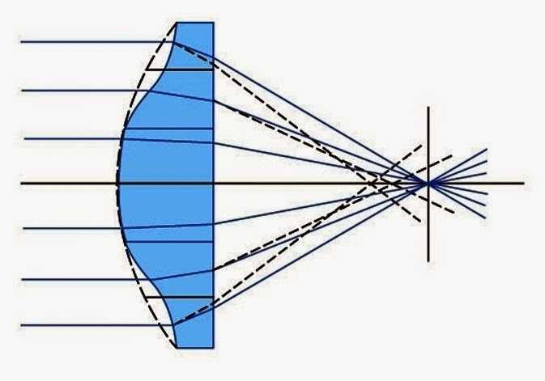
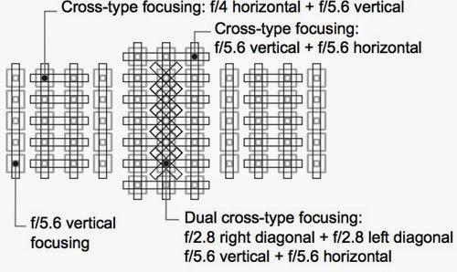

# 影响跑焦的因素

在刨去因为组装等问题人为因素的影响下，跑焦的客观原因如下：

1。 镜头里球面镜片引起的多重焦点会让相机自动对焦模块变傻，不知道到底哪个是真正的焦点。

2。 和被拍摄的物体也有关系，被拍摄物体明暗差别密集度有关系。这一点是相位差对焦没法解决的。也就是说有两个焦点，一个是锐度的焦点，一个是分辨率的焦点。这一点在尼康工作人员那里也得到了[证实](http://forum.xitek.com/thread-526553-1-1-2.html)。 以上2点所引起的跑焦分析可以看[帖子](http://lijie.org/capss/)。

3。 对焦准确度问题，F2.8准确度的af sensor比其余的对焦sensor对焦准确度更高一些。

4。色温居然也[影响对焦](http://forum.xitek.com/forum-viewthread-tid-575425-extra-page%3D1-ordertype-2-t-1329570924.html)。 5。 环境光线影响对焦精度。这个好理解，极端条件就是，没对比度的地方，等着镜头拉风箱吧。

6。 机身固件问题。数码单反机身内一般都包括自己镜头的一些数据，但是对于老相机，固件不再升级，从而也就不会包含新镜头的数据，导致新镜头在旧机身上容易跑焦。

其他影响因素还可以一直列下去，但是没信心了。

看了这么多不可抗拒力，如果你镜头稍微跑焦，那你死心吧，彻底死心吧。因为跑焦是正常的，完全无误合焦才是诡异事件

