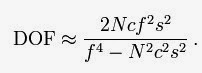
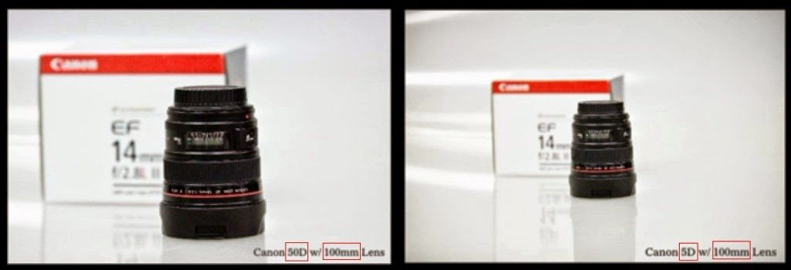
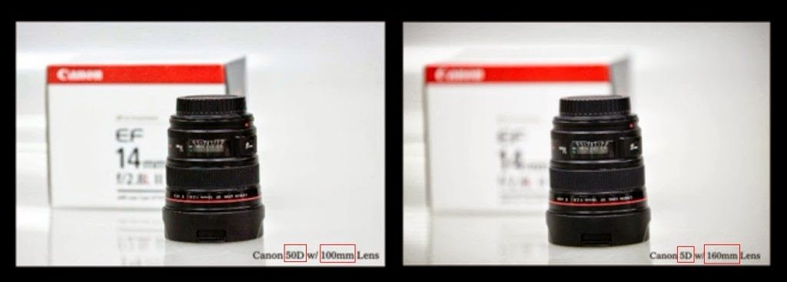

# 关于全画幅和aps-c画幅景深比较

是自己的理解，有任何不对的地方，欢迎交流。

首先先确定影响景深(DOF: Depth Of Field)的因素，根据wikipeida上的景深计算公式(此公式在拍摄距离大于镜头焦距的情况下成立，下面的讨论都是在这种情况下)可以知道：

其中：

- N是拍摄时镜头的光圈值
- c是相机弥散圆直径，而弥散圆与相机的画幅有关系
- f是镜头焦距，这里的焦距分为两种情况，后面会分别介绍
- s是拍摄距离

可以看到，影响景深的因素有：

- 光圈大小
- 画幅大小
- 镜头焦距
- 拍摄距离

情况一、当两个一模一样的50mm镜头，在相同的3m距离下，使用相同的f/2.8光圈拍摄时，全画幅和aps-c画幅的景深区别如下(根据上面的公式，写了个[景深计算器](https://lijie.org/tools/dof.php)，本文中所有的景深数值全部来自此计算器)：

全画幅景深：

aps-c画幅：

结论：情况一下，aps-c画幅要比全画幅景深浅，但可以想象的是，全画幅拍出来的照片视野要广。

情况二、当视野相同的时候，这时镜头焦距就不一样了，假设全画幅(感光元件长度为36mm)上使用75mm的镜头，那么aps-c(感光元件水平长度为24mm)上就要使用50mm的镜头了。光圈还是f/2.8，拍摄距离还是3米:

全画幅景深：

aps-c画幅景深：

结论：情况二下，如果拍摄视野相同的照片，那么全副的景深要比aps-c的浅。

两种情况下得出的结论是不一样的。

附加一段视频说明，视频来自youtube，传到了国内的youku上：

视频中摄影师通过实际拍摄将上面的两种情况都进行了说明，不同的是第一种情况下，视频中的图片看不出来aps-c比全画幅景深浅，而第二种情况则可以体现出来。

第一种情况，场景的缘故，看不出来aps-c景深更浅，点击可以看大图：

第二种情况，可以明显看到全画幅景深浅，点击可以看大图：

需要说明的是，视频中是按照1.6倍的关系说明的，而本文是按照1.5倍说明的，能看出差别即可。

在视频结束部分，主持人说一般体育摄影者如果使用aps-c画幅会有优势，因为可以”更接近”被拍摄的物体，也就是赢得的长焦的优势。严格意义上说，这种说法不严谨，因为就拍摄的画面大小而言，aps-c仅仅是取了全画幅中间一部分，也就是视角比全画幅小了，这在视频开始也进行了演示说明（当然，景深是不一样的。）。

就目前来讲，厂家所设计的aps-c画幅相机的[像素密度](http://info.xitek.com/product/200910/22-29453.html)一般都要高于全画幅，所以情况一下，如果将全画幅所拍摄画面裁减为aps-c的视野大小，清晰度是不及aps-c的，如果全画幅像素密度高于aps-c画幅，那么全画幅裁剪后还要比aps-c清晰，那么aps-c画幅相机就没有卖点了。

