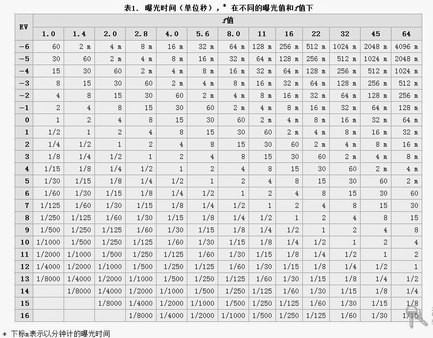
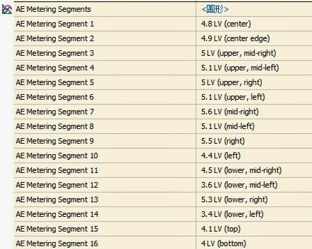

# 什么是EV

注：本文在严格意义上来说并不严谨，仅仅是为了摄影爱好者对一些常见词能有个直观的了解而写。

EV，全称是（Exposure Value，即曝光值），Wikipedia上有[解释](https://en.wikipedia.org/wiki/Exposure_value)（[中文](https://zh.wikipedia.org/wiki/%E6%9B%9D%E5%85%89%E5%80%BC)）。

笼统来说，EV就是用来衡量我们生活环境周围亮度的一个单位。

根据wikipedia上的定义，0EV就是光圈在f/1.0，ISO在100的情况下，曝光时长1s的时候的亮度。凭借平时我们拍照的经验可以知道，这个0EV是相当暗的环境了。

下表是wikipedia上列出的一些EV值表：

宾得新出的旗舰机型K-5II/K-5IIs对焦系统可以工作的环境是-3EV，查上面的表可以知道，是光圈在F/1.0，ISO100，曝光8秒的暗部环境下，相当厉害。

这里再介绍个能够通过照片EXIF信息提取出EV信息的软件：PhotoME

软件也有繁体中文版，翻译不完整，但是能看个大概。打开软件后可以看到里面非常多的内容，原来照片的EXIF信息包含这么多东西在里面。

随便打开一张照片，在右侧一堆堆的信息中可以找到AE Metering Segments，这里列出了我拍的一张照片的16个区域的EV值，如下图所示：

还有更直观的方式，点击 图形 两个字：

软件还可以显示拍照时的对焦点，相机的快门次数（对于宾得是实实在在的快门数），拍照时电池电量信息，拍照时相机机身温度，。这个软件很值得研究一下，里面的内容实在太多了。

