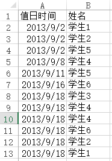
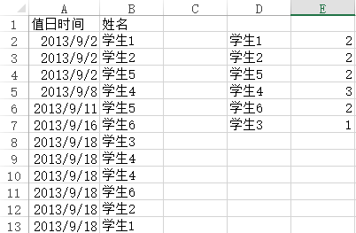
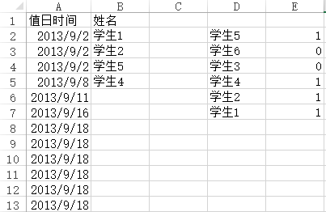

# Excel小技巧

最近使用excel比较多，记录操作两个，都比较笨。

如下数据：

 

一、**统计下有几个学生值日，并且统计值日次数。**

复制学生姓名到任意一列，比如D列，选中D列的学生姓名，点击“数据”-》“删除重复项”，可以得到没有重复的数据，然后点击E2单元格，上面输入公式=COUNTIFS(B:B,D2)，意思是比较B列和从D2开始的数据。接着拖动E2往下，即可得到如下结果：

**二、统计下哪些新同学在11号以后值日，即11号以前没有值过日。**

剪切（注意是剪切）b6到b13的数据到新的一列，比如D列，删除重复数据后，在E2输入公式：=COUNTIFS(B:B,D2)，往下拖动，其中显示数字为0的就是想要的结果，即11号之前没有值日的同学。

三、比较两列数据中是否有相同项目

空白列输入=MATCH(A1,B:B,)，意思是从A1单元格开始，A列每个单元格都和B列的数据进行比对，并显示区B列和A列相同数据的坐标。

