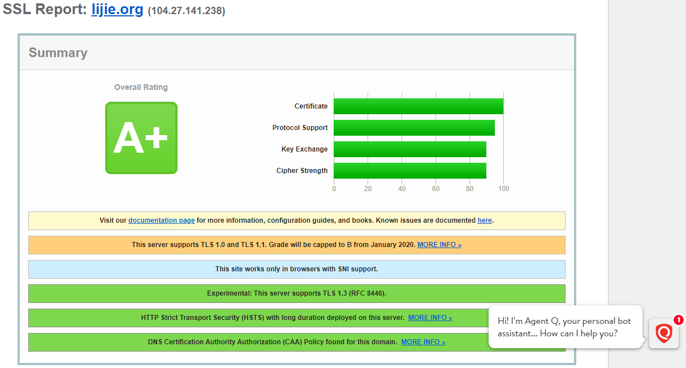

# 域名如何开启HTTPS,HTTP/2以及HSTS


对于站长，配置域名的https, http/2以及hsts是家常便饭，之前的[博客](https://lijie.org/2016/06/27/vultr-vps%e9%85%8d%e7%bd%ae%e7%ac%94%e8%ae%b0/)说过，这里使用免费的let's encrypt来演示，环境是ubuntu18.04 + nginx，域名使用lijie.org，下面的命令替换成自己的域名即可。

## 开启https
```shell
sudo add-apt-repository ppa:certbot/certbot #将let's encrypt加入ubuntu软件源,ubuntu 18.04及之前版本，ubuntu20.04方法如下
sudo apt-get update #更新列表
sudo apt-get install python-certbot-nginx #安装certbot,ubuntu 18.04及之前版本，ubuntu20.04方法如下  
  
apt install certbot python3-certbot-nginx #ubuntu20.04开始直接安装就行，不需要另外添加lets encrypt源。

sudo ufw allow 'Nginx Full' #将80, 443端口开启，加入防火墙
sudo certbot --nginx -d lijie.org -d www.lijie.org #使用certbot给两个域名申请ssl
```
执行上述命令会提示：

Please choose whether or not to redirect HTTP traffic to HTTPS, removing HTTP access.  
\------------------------------------------------------------------------------------

1: No redirect - Make no further changes to the webserver configuration.  
2: Redirect - Make all requests redirect to secure HTTPS access. Choose this for  
new sites, or if you're confident your site works on HTTPS. You can undo this  
change by editing your web server's configuration.  
\------------------------------------------------------------------------------------ 

Select the appropriate number [1-2] then [enter] (press 'c' to cancel):

这里选择2，按回车，剩下的问题按y，同意即可。

https就配置完成了，访问[https://www.ssllabs.com/ssltest/](https://www.ssllabs.com/ssltest/)，评分会的A，下面我们继续配置，让其得分到A+。

## 添加HTTP/2支持
```shell
sudo nano /etc/nginx/sites-available/lijie.org #编辑网站的nginx配置文件
```
找到并添加
```nginx
listen [::]:443 ssl http2 ipv6only=on;  #新添加http2
listen 443 ssl http2;    #新添加http2
```
按Ctrl + O保存，然后按Ctrl + X退出后，检查nginx配置文件是否正确
```shell
sudo nginx -t #检查配置文件是否正确，一般没问题
sudo service nginx reload #重新加载nginx配置文件，使得修改生效
```
这样http/2配置基本完成，下面来提高http2的安全性。

依旧打开网站配置文件：
```shell
sudo nano /etc/nginx/sites-available/lijie.org
```
找到let's encrypt替我们生成的下面的语句，前面添加#号将其注释掉：
```nginx
# include /etc/letsencrypt/options-ssl-nginx.conf; # managed by Certbot
```
另起一行，加入：
```nginx
ssl_ciphers EECDH+CHACHA20:EECDH+AES128:RSA+AES128:EECDH+AES256:RSA+AES256:EECDH+3DES:RSA+3DES:!MD5;
```
```shell
sudo nginx -t 
sudo service nginx reload #没问题后，重新加载nginx
```
验证下http2是否生效，命令行输入：
```shell
curl -I -L https://lijie.org
```


从返回结果可以看到，http/2生效了。

## 添加HSTS支持

目前我们使用的https使用的是301转向，即用户先访问http://lijie.org，nginx收到请求后，将80端口的http请求通过301转向到443端口的https。为了避免301转向期间存在的有可能的安全漏洞，我们需要添加hsts功能，强制让浏览器直接访问443端口，而避免访问80端口的http。

编辑nginx配置文件：
```shell
sudo nano /etc/nginx/nginx.conf #打开nginx配置文件
```
在配置文件中找到并添加一行：
```nginx
include /etc/nginx/conf.d/*.conf;
include /etc/nginx/sites-enabled/*; 
add_header Strict-Transport-Security "max-age=31536000; includeSubdomains; preload" always; #在配置文件中新增这一行
```
这样hsts就配置完毕了，但是用户第一次访问的时候还要301转向，否则看不到hsts的头部包信息，但是随后就不用了。为了避免这个问题，谷歌的chrome浏览器维持了一个开启hsts的网站列表，[https://hstspreload.org](https://hstspreload.org)，可以将自己的网站提交上去，其它的像是firefox，edge等浏览器也会参考此列表。由于本网站套用了CF，无法hstspreload的检测。

开始hsts后，再次访问[https://www.ssllabs.com/ssltest/](https://www.ssllabs.com/ssltest/)，网站域名的https评分会从A变为A+。


