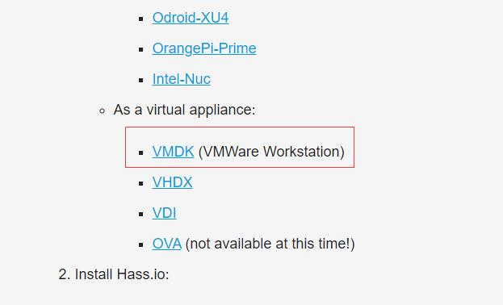
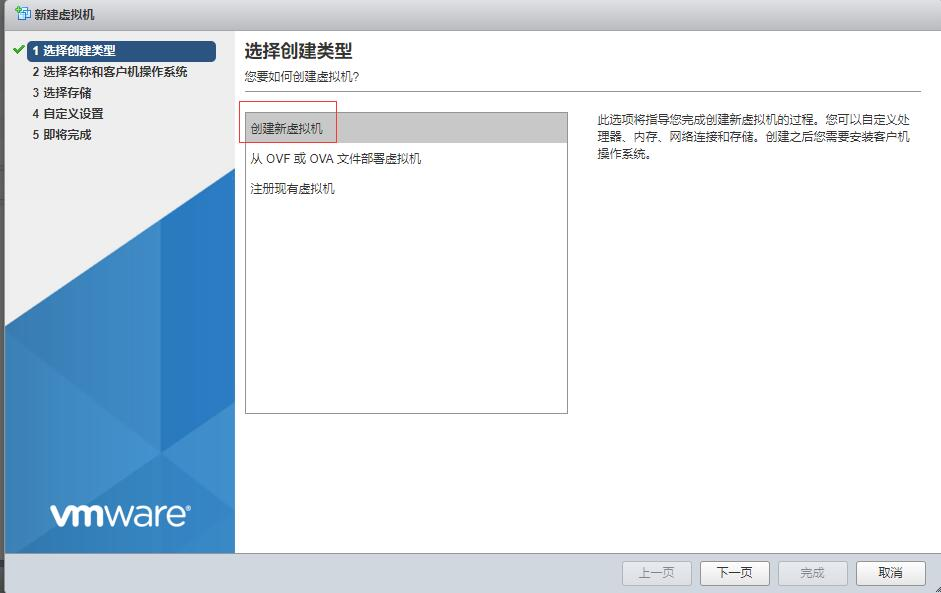
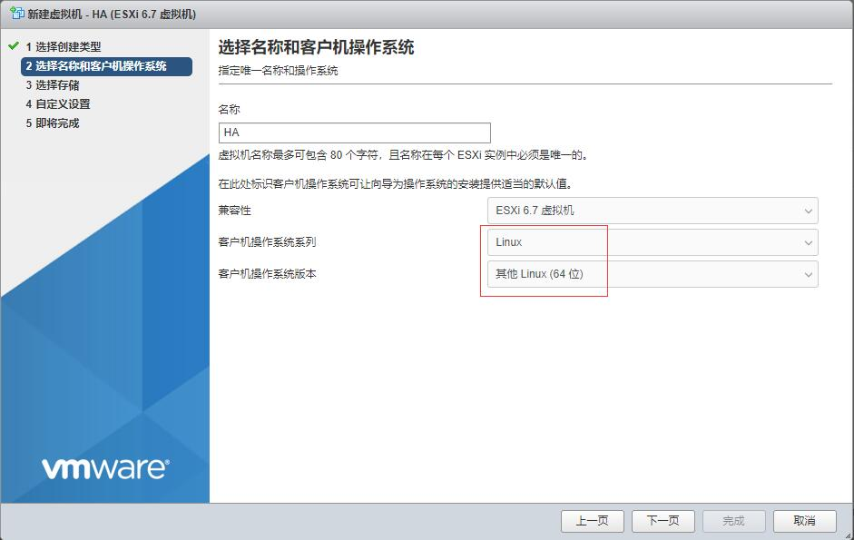
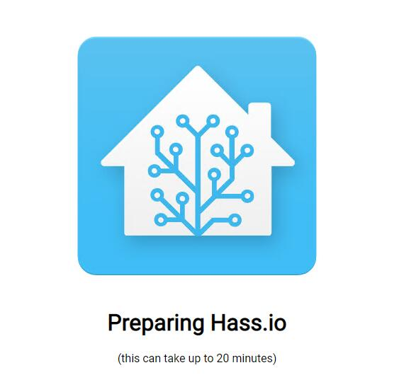

# 如何在ESXI中安装Home Assistant


家里有个ESXI虚拟化平台的确是方便，除了可以使用软路由，很多系统都可以安装进去，这里简单说下如何在**ESXI**中安装**Home Assistant**，网上大部分教程都是在Linux中的docker里跑HA。

视频演示过程：[youtube](https://www.youtube.com/watch?v=26bv7qNSBgg), [B站](https://www.bilibili.com/video/av70977447/)

首先到[官网](https://www.home-assistant.io/hassio/installation/)下载HA的虚拟机文件



下载vmdk文件

将解压缩出来的文件上传到esxi，打开esxi的SSH权限，进入后台，使用下面的命令将vmdk文件转换为esxi可以使用的文件。
```shell
vmkfstools -i hassxxx.vmdk 1.vmdk
```
随后创建虚拟机



新建虚拟机



按照框框里的选择好

然后下一步，下一步。建立好虚拟机后，开始调整虚拟机配置。调整配置很重要。

1. 删除**CD/DVD驱动器**，然后添加硬盘，**添加现有硬盘**，选择上面转换好的1.vmdk文件。**删除默认分配的硬盘**。
2. 点击硬盘左侧的三角，控制器位置选择**IDE控制器0**，右侧选择**主要**。
3. 虚拟机选项下面的引导选项，选择EFI。
4. 记得调整cpu和内存数量。

完成上述的配置调整后，就可以给虚拟机通电了，随后访问hassio.local:8123就能打开HA的首页了。



如果访问hassio.local:8123无法打开这个页面，等待5-10分钟再访问


在首页等待一会儿之后，就会自动跳转到管理员设置页面

以上就是安装的粗略过程。

