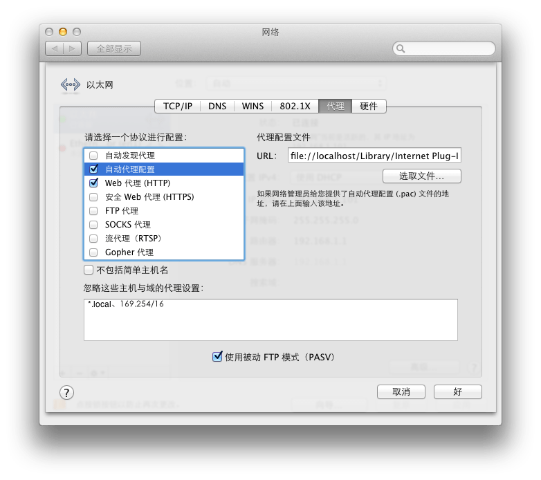

# Safari下使用goagent

黑苹果除了safari比较稳定之外，Chrome和Firefox都不稳定。所以搜索了下如何在Safari下配合goagent一起使用。步骤如下：

1\. 在Chrome的SwitchySharp插件的选项中将pac文件导出。

2\. 到download目录下将导出的SwitchyPac.pac复制到~/Library/Internet Plug-Ins目录中。中文路径就是mac系统盘下的资源库。

3\. 在Safari偏好设置当中，选择高级-代理。如下图所示，选择第二项自动代理配置，在右侧选择刚才的pac文件。

4\. 在第三项web代理(HTTP)，右侧填写goagent地址，默认是127.0.0.1:8087。

如何查看隐藏文件夹？

在终端执行 defaults write com.apple.Finder AppleShowAllFiles YES，然后再执行 Killall Finder。就可以在finder中看到隐藏文件及文件夹了。

