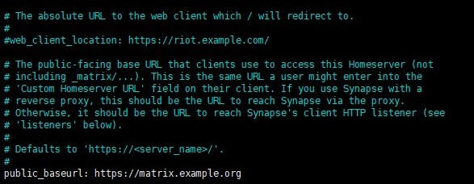

# Setting up your own Matrix Synapse  service on VPS



For the past one month, I've been digging around the internet about the **decentralized fediverse** community.  Platforms like **Mastodon**, [**Matrix Synapse**](https://github.com/matrix-org/synapse), **Pixelfed** etc are the open-source implementations of twitter, IMs like telegram Signal and instagram, and more importantly these platforms are all decentralized, which means your posts/pics/blog/account belongs to yourself, and won't be deleted by those BIG companies for no reason, especially those stupid companies in China like weibo, bilibili, douyin etc. Ad-free, no user privacy tracking/leaking are also advantages of the fediverse platforms.

Up to now, I've tried my hand on Soapbox FE, Matrix Synapse and got them successfully running on my VPS. This post mainly focuses on the installation of Matrix Synapse which was written in Python. There is a Go version of Matrix - **[Dendrite](https://github.com/matrix-org/dendrite)**. It's more efficient and maybe the VPS hardware requirements aren't that high. But it's still in the beta version, not recommended for the  production environment.

Minimal VPS Specs: 1-core vCPU, 1G of RAM, here is the utilization of Synapse running on my VPS(just 1 user), 2G RAM is recommended for users less than 20. The OS is Ubuntu 20.04.

I've made a test video call between my 2 phones, the CPU ( Intel(R) Xeon(R) CPU E5-2690 v4 @ 2.60GHz ) usage is around 25%, so a 2-core CPU is recommended.


I want to use the base domain as part of the user name, like @user:domain.org, instead of @user:matrix.domain.org which is the actual server address. In this case, you can host other websites with the base domain example.org.

Let's get rolling!

## 1. Install matrix synapse package

### 1.1 Installation
```shell
sudo apt update 
sudo apt upgrade -y
sudo apt install lsb-release wget apt-transport-https -y

sudo wget -qO /usr/share/keyrings/matrix-org-archive-keyring.gpg https://packages.matrix.org/debian/matrix-org-archive-keyring.gpg 
sudo echo "deb [signed-by=/usr/share/keyrings/matrix-org-archive-keyring.gpg] https://packages.matrix.org/debian/ $(lsb_release -cs) main" | sudo tee /etc/apt/sources.list.d/matrix-org.list

sudo apt update 
sudo apt upgrade 
sudo apt install matrix-synapse-py3
```

One window will pop up, **enter the base domain name example.org, NOT matrix.example.org**, it's very important. Hit ```OK``` and then ```NO```.


```shell
sudo systemctl enable matrix-synapse 
sudo systemctl start matrix-synapse 
sudo systemctl status matrix-synapse
```


Go through the log file if synapse is not running:

```shell
sudo tail -f /var/log/matrix-synapse/homeserver.log
```

Make sure again by typing:

```shell
sudo netstat -lnpt | grep :8008
```


### 1.2 Change the configurations:

Generate the Matrix Synapse registration secret:

```shell
cat /dev/urandom | tr -dc 'a-zA-Z0-9' | fold -w 32 | head -n 1
```


  
Edit the synapse config file:

```shell
sudo nano /etc/matrix-synapse/homeserver.yaml
```

Press Ctrl+w to find ```registration_shared_secret:``` uncomment it and change the value with the generated random string.


  
Find the following lines and change the value correspondingly:

```ini
enable_registration: false
allow_public_rooms_without_auth: false
allow_public_rooms_over_federation: false
```

Press Ctrl+o to save the file and Ctrl+x to exit. Then restart the synapse service:

```shell
sudo systemctl restart matrix-synapse
```

Again, if anything goes wrong, check out the log file.

```shell
sudo tail -f /var/log/matrix-synapse/homeserver.log
```

### 1.3 Install Nginx and certbot

```shell
apt install nginx certbot python3-certbot-nginx -y
```

Generate the SSL certificates:

```shell
sudo systemctl stop nginx
sudo certbot certonly -d example.org -d matrix.example.org
```

### 1.4 Create Nginx config files
#### 1.4.1 Base domain config file

```shell
cd /etc/nginx/sites-available
sudo nano example.org
```

Change the contents to:

```nginx
server {
        root /var/www/example.org;  # You can host another website here or do a reverse proxy.

        # Add index.php to the list if you are using PHP
        index index.html index.htm index.nginx-debian.html;

        server_name example.org;

        location / {
                # First attempt to serve request as file, then
                # as directory, then fall back to displaying a 404.
                try_files $uri $uri/ =404;
        }

    location /.well-known/matrix/client {
        # pay attention here, help clients like element to find the actual address.
        return 200 '{"m.homeserver": {"base_url": "matrix.example.org</a>"}}';
        default_type application/json;
        add_header Access-Control-Allow-Origin *;
    }

    location /.well-known/matrix/server {
        return 200 '{"m.server": "matrix.example.org:443"}';
        default_type application/json;
        add_header Access-Control-Allow-Origin *;
    }

    listen [::]:443 ssl ipv6only=on; # managed by Certbot
    listen 443 ssl; # managed by Certbot
    ssl_certificate /etc/letsencrypt/live/example.org/fullchain.pem; # managed by Certbot
    ssl_certificate_key /etc/letsencrypt/live/example.org/privkey.pem; # managed by Certbot
    include /etc/letsencrypt/options-ssl-nginx.conf; # managed by Certbot
    ssl_dhparam /etc/letsencrypt/ssl-dhparams.pem; # managed by Certbot

}

server {
    if ($host = example.org) {
        return 301 https://$host$request_uri;
    } # managed by Certbot
    listen 80;
    listen [::]:80;
    server_name example.org;
    return 404; # managed by Certbot
} 
```

#### 1.4.2 Subdomain config file

```shell
sudo nano matrix.example.org
```

Change the content to:
```nginx

server {
    listen 443 ssl http2;
    listen [::]:443 ssl http2;

    # make your synapse instance federated. 
    listen 8448 ssl http2;  
    listen [::]:8448 ssl http2;

    server_name matrix.example.org;

    ssl_certificate /etc/letsencrypt/live/matrix.example.org/fullchain.pem;
    ssl_certificate_key /etc/letsencrypt/live/matrix.example.org/privkey.pem;

    ssl_protocols TLSv1.2 TLSv1.3;
    ssl_prefer_server_ciphers on;
    ssl_ciphers ECDHE-RSA-AES256-GCM-SHA512:DHE-RSA-AES256-GCM-SHA512:ECDHE-RSA-AES256-GCM-SHA384:DHE-RSA-AES256-GCM-SHA384:ECDHE-RSA-AES256-SHA384;
    ssl_session_timeout  10m;
    ssl_session_cache shared:SSL:10m;
    ssl_session_tickets on;
    ssl_stapling on;
    ssl_stapling_verify on;

    location ~ ^(/_matrix|/_synapse/client) {
        # note: do not add a path (even a single /) after the port in `proxy_pass`,
        # otherwise nginx will canonicalise the URI and cause signature verification
        # errors.
        proxy_pass http://127.0.0.1:8008;
        proxy_set_header X-Forwarded-For $remote_addr;
        proxy_set_header X-Forwarded-Proto $scheme;
        proxy_set_header Host $host;

        # Nginx by default only allows file uploads up to 1M in size
        # Increase client_max_body_size to match max_upload_size defined in homeserver.yaml
        client_max_body_size 200M;  # support file size up to 200MB
    }

    # make your synapse instance federated.
    location / {  
        proxy_pass http://localhost:8008;
        proxy_set_header X-Forwarded-For $remote_addr;
    }  
}
server {
    if ($host = matrix.example.org) {
        return 301 https://$host$request_uri;
    } # managed by Certbot

    listen 80;
    listen [::]:80;
    server_name matrix.example.org;
    return 404; # managed by Certbot
}
```

Link the config file to sites-enables folder and restart nginx

```shell
ln -s /etc/nginx/sites-available/example.org /etc/nginx/sites-enabled/
ln -s /etc/nginx/sites-available/matrix.example.org etc/nginx/sites-enabled/

nginx -t
systemctl restart nginx
```
## 2. Setting up Postgres

Issue the following commands:

```shell
sudo apt install postgresql postgresql-contrib
sudo -i -u postgres
```
```sql
--database user and password
CREATE USER "synapseuser" WITH PASSWORD 'Password'; 
CREATE DATABASE synapse ENCODING 'UTF8' LC_COLLATE='C' LC_CTYPE='C' template=template0 OWNER "synapseuser";
exit
```
```shell
sudo apt install python3-psycopg2
```

Edit synapse config file:

```shell
sudo nano /etc/matrix-synapse/homeserver.yaml
```

Since I'll use PostgreSQL instead of sqlite3, comment out the following lines:

```ini
# database:
#  name: sqlite3
#  args:
#    database: /path/to/homeserver.db
```
Uncomment the following lines:

```ini
database:
  name: psycopg2
  txn_limit: 10000
  args:
    user: synapseuser  
    password: password  # enter the database username & password created above.
    database: synapse
    host: localhost
    port: 5432
    cp_min: 5
    cp_max: 10
```
Looks like this:


Change public_baseurl to the real domain matrix.example.org **(IMPORTANT!)**:



Find and change maximum file size to 200M

```ini
max_upload_size: 200M
```

Since the file size has been changed in the nginx config file of matrix.example.org, there is 1 more place need to be changed:

```shell
sudo nano /etc/nginx/nginx.conf
```
Add the following line in http section:
```ini
client_max_body_size 200M;
```
Save & exit. Restart synapse & nginx:
```shell
sudo systemctl restart matrix-synapse
sudo nginx -t
sudo systemctl restart nginx
```
Enable ports:
```shell
ufw allow OpenSSH
ufw allow 'Nginx Full'
ufw allow 8448
```
Visit https://matrix.example.org:8448, you'll get this page:


Visit [https://federationtester.matrix.org/](https://federationtester.matrix.org/) , enter the base domain example.org to test if everything is OK.

## 3. Create the admin account

```shell
register_new_matrix_user -c /etc/matrix-synapse/homeserver.yaml http://localhost:8008
```
Type name & password, and then type yes when asked if make it admin.

Visit [https://app.element.io/#/login](https://app.element.io/#/login) to login. Click Edit at the upper-right corner of the page, and then fill in the actual synapse address:


  
Hit Continue and then enter the username and password you just created. You might see something like this as well🤣🤣🤣


## 4. Upgrade

Upgrading synapse to the latest version is just like upgrading other softwares on ubuntu, Executing apt full-upgrade would do the job. But before doing that, make sure to backup your ```homeserver.ymal``` and then press n when asked wheather or not to replace the config file.


