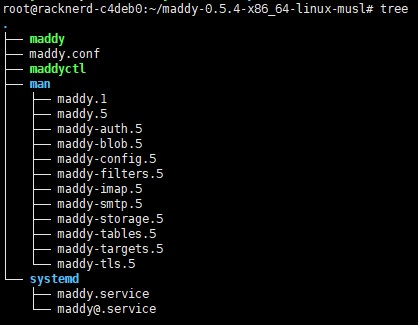
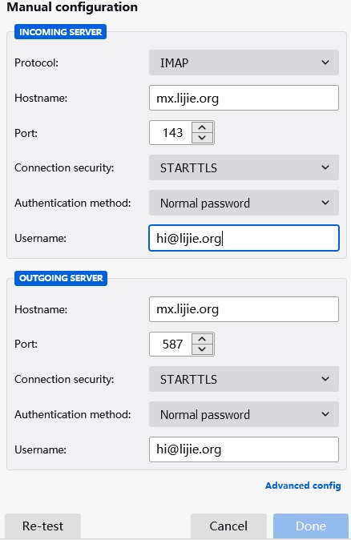
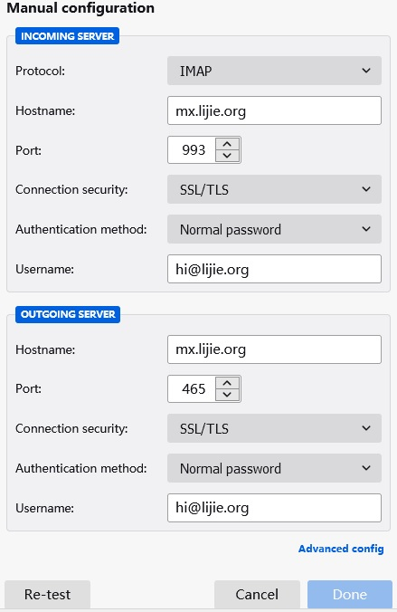

# 使用Maddy搭建自己的邮箱服务

## 1 准备工作
### 1.1 服务器要求
搭建以前，一定要确认自己的vps是否开通了25端口，以及是否可以设置rDNS，否则下面不用看了。我使用的[racknerd的VPS](https://my.racknerd.com/aff.php?aff=2538)，一年只需要10美元左右，符合搭建的要求，推荐大家在这家注册使用。

使用[Maddy](https://maddy.email/)搭建邮箱服务挺方便，这里记录下，供以后再搭建时使用。

将文中**example.org**域名替换成自己的


### 1.2 域名设置
先设置二级域名，mx.example.com，A记录和AAAA记录分别指向服务器ipv4地址和ipv6地址。然后设置根域名(@)mx记录，指向mx.example.com

## 2 安装maddy
### 2.1 下载
这里使用Maddy编译好的[文件](https://github.com/foxcpp/maddy/releases)进行。先下载并解压缩（目前是0.5.4版本）:

```shell
wget https://github.com/foxcpp/maddy/releases/download/v0.5.4/maddy-0.5.4-x86_64-linux-musl.tar.zst
apt install zstd
tar --use-compress-program=unzstd -xvf maddy-0.5.4-x86_64-linux-musl.tar.zst
cd maddy-0.5.4-x86_64-linux-musl
mv maddy maddyctl /usr/local/bin/
mkdir /etc/maddy && mv maddy.conf /etc/maddy/
mv systemd/*.service /usr/lib/systemd/system/
mv man/*.1 /usr/share/man/man1/ && mv man/*.5 /usr/share/man/man5/
```
运行tree命令，可以看到maddy目录结构很简单，主要是maddy和maddyctl两个可执行文件和maddy.conf配置文件



### 2.2 添加程序用户
为Maddy程序添加一个单独的用户并且授予权限:

```shell
useradd -mrU -s /sbin/nologin -c "maddy mail server" maddy
chown -R maddy:maddy /usr/local/bin/maddy* /etc/maddy
```

### 2.3 获取SSL证书
获取证书，需要先停止占用80端口的程序，比如nginx:

```shell
apt install snapd
snap install --classic certbot
certbot certonly --standalone --preferred-challenges http -d mx.example.com
apt install acl
mkdir -p /etc/maddy/certs
mkdir -p /etc/maddy/state
mkdir -p /etc/maddy/runtime
mkdir -p /etc/maddy/log
chown maddy:maddy /etc/maddy -R
setfacl -R -m u:maddy:rX /etc/maddy/certs/
setfacl -R -m u:maddy:rX /etc/letsencrypt/{live,archive}
cd /etc/maddy/certs
ln -s /etc/letsencrypt/live/mx.example.com
```
## 3 配置Maddy

```shell
nano /etc/maddy/maddy.conf
```
### 3.1 添加域名
修改以下内容:
```ini
$(hostname) = mx.example.com
$(primary_domain) = example.com
$(local_domains) = $(primary_domain)
```
添加以下内容:
```ini
state_dir /etc/maddy/state
runtime_dir /etc/maddy/runtime
log syslog /etc/maddy/log/maddy.log
```
保存，退出。

### 3.2 添加邮箱用户
创建用户和对应的密码:
```shell
maddyctl creds create hi@example.com
maddyctl imap-acct create hi@example.com
```
## 4 启动maddy服务:
### 4.1 启动服务
```shell
chown maddy:maddy /etc/maddy -R #这里会再运行一次，不然会报错
service maddy start
```
### 4.2 客户端配置
这时候就可以使用thunderbird或者需要smtp服务的程序等工具连接邮箱了。



## 5 更多配置

### 5.1 防止邮件进入垃圾箱
为了避免邮件进入垃圾邮箱，域名还需要进行配置:

```ini新建一个根域名(@)的TXT记录，值为v=spf1 mx ~all
新建 _dmarc 的TXT记录，值为 v=DMARC1; p=quarantine; ruf=mailto:hi@example.com
新建 default._domainkey 的TXT记录，值为 /etc/maddy/state/dkim_key/example.com_default.dns 文件的内容，类似于 v=DKIM1; k=rsa; p=MII...AB
```
最后要到VPS主机商那里，设置下rDNS记录，指向mx.example.com，这一步很重要，我使用的[racknerd的vps](https://my.racknerd.com/aff.php?aff=2538)，一年才10美元左右，可以发ticket让客服将rdns指向你的mx.example.com，一般5分钟左右就能设置好。
这样一来，邮件不会进垃圾箱了。

### 5.2 设置开机启动
设置maddy开机启动:
```shell
systemctl enable maddy
```
更多命令可以使用 maddyctl command -h 查看，比如执行 maddyctl creds -h 可以看到:

### 5.3 更多设置
```shell
maddyctl creds list  列出当前所有用户
maddyctl creds create name@example.com 创建用户
maddyctl creds remove name@example.com 删除用户
myaddyctl creds password name@example.com 修改密码
```
### 5.4 版本升级
升级Maddy，将新版本的maddy下载下来，将maddy和maddyctl拷贝到下面目录即可
```shell
systemctl stop maddy
mv maddy maddyctl /usr/local/bin/
```
