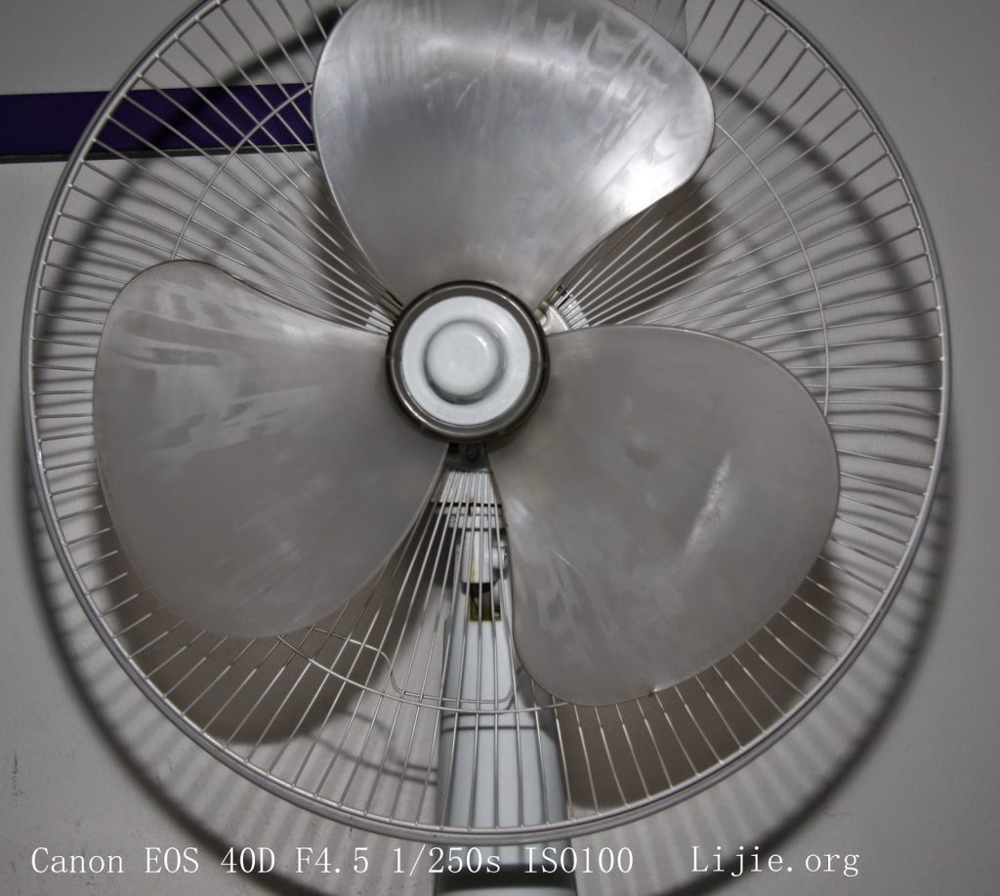
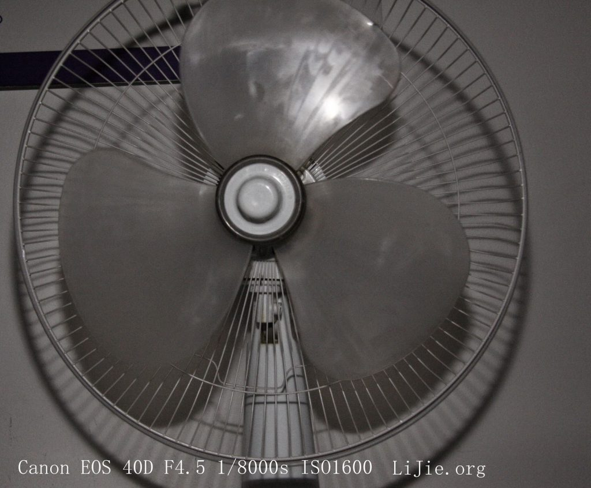

# 闪光灯学习

注：本文~~尚未写完~~暂时写完，不免会有一些逻辑性错误。会在后面不断修正。文章不限于闪光灯，还有由高速闪光同步所引出的其它一些内容，比如变形问题，录像时所产生的的其余问题等。

## 1. 闪光灯记录
快门速度和光圈大小影响环境光(ambient light)亮度，而影响被拍摄主题的亮度的只有光圈值；因为闪光灯闪光时间（[Flash duration](http://www.paulcbuff.com/sfe-flashduration.php)）很短暂，如果快门速度慢了，会增加环境光的进光量，不会增加闪光灯的进光总量，所以被摄物体亮度不变，而当光圈变大时，会增加闪光灯的进光总量，被摄物体也会变亮，相应的环境亮度也会提高，所以为了维持环境光不变的情况下，需要增加快门速度（增加快门速度不会改变被摄物体亮度）。

- 被摄物亮度不变，增加环境光亮度：降低快门速度
- 被摄物亮度不变，降低环境光亮度：提高快门速度
- 环境光亮度不变，增加被摄物亮度：增大光圈，同时提高相应档次的快门速度
- 环境光亮度不变，降低被摄物亮度：缩小光圈，同时降低相应档次的快门速度
## 2. 调整被摄物亮度的几种方法
- 手动直接调节闪光灯的功率
- 调节相机光圈
- 调整闪光灯和物体的距离（球的表面积计算公式: 球的表面积=4πr^2）。
## 3. ISO
增大ISO，可以在降低闪光灯功率的情况下得到相同的亮度，从而可以延长电池使用时间。
## 4. TTL = Through The Lens
## 5. 高速闪光和后帘同步无法同时使用。
## 6. 光线影响
光线不好的环境下，相机快门速度即使很慢，当环境光对被摄物体不产生影响时，你实际的快门速度是闪光灯的flash duration。可以参看[视频](http://v.youku.com/v_show/id_XMjE4ODI1NTQw.html)。当环境光影响最后成像效果时，可以根据拍摄要求缩小光圈或者降低ISO值，然后试拍一张，如果拍的是全黑的，说明环境光已经不影响成像了，这时的快门速度就是闪光灯的闪光速度了，[视频](https://www.youtube.com/watch?v=WwcFbRUfHkk)说明。
## 7. 每档光圈值
F1， F1.4， F2， F2.8， F4， F5.6， F8， F11， F16， F22， F32， F44， F64
## 8. Flash duration
佳能580EX的flash duration（[网上](http://www.waynesthisandthat.com/flashdurations.html)找的非官方[有争议](http://www.rodandcone.com/2008/05/flash-durations-for-canon-580ex-ii-and.html)的t.5数据）：

- 1/1    power = 1/1000   second
- 1/2    power = 1/2000   second
- 1/4    power = 1/4000   second
- 1/8    power = 1/9000   second
- 1/16   power = 1/15000  second
- 1/32   power = 1/21000  second
- 1/64   power = 1/30000  second
- 1/128  power = 1/35000  second

## 9. EOS闪灯[说明书](http://photonotes.org/articles/eos-flash/)。
## 10. HSS
HSS时，因为快门不是完全打开，所以相机无法全部接收闪光灯所发出的光，所以在HSS时，GN值会随着快门速度变快而[变小](http://www.photozone.de/hi-speed-flash-sync)，所以HSS时要离拍摄物体更近一些；另外相机画幅大小对闪光灯GN指数也有[影响](http://www.mobile01.com/topicdetail.php?f=257&t=2770123#36265579)。
## 11. HSS闪烁频率
至于在HSS时，闪光灯的闪烁频率，目前在网上还没找到，但是观看这段高速摄影机拍摄的[视频](http://v.youku.com/v_show/id_XNzI0NTI1OTg4.html)可以发现，频闪时，闪烁频率是非常高的（视频[作者称](https://www.youtube.com/watch?v=HavUWH7-fSk)，这是放慢2万倍后的效果），至于可能产生的物体变形问题，在下面第13条具体讨论。
## 12. HSS功耗
HSS时会消耗更多的电量，会降低灯的GN值，但是普威的闪灯收发器却可以根据不同的快门速度来匹配相应的闪灯的闪烁频率，减少快门打开前闪灯的闪光时间，从而可以延长电池使用时间，提高回电速度，并且可以提高2档的闪光强度，相当于提高了GN值，具体如何做到的，可以看[文章](http://www.pocketwizard.com/inspirations/technology/fp_sync_hss/)，不是能完全看懂那几张图。[HyperSync](http://wiki.pocketwizard.com/index.php?title=Understanding_HyperSync_and_High_Speed_Sync)。
## 13. 果冻效应
高于X快门时的运动物体会变形（类似于摄像出现的[果冻效果](http://www.nphoto.net/news/2012-09/25/858d44e576553cc0.shtml)，[Rolling shutter](http://en.wikipedia.org/wiki/Rolling_shutter)，[视频演示](http://www.tudou.com/programs/view/QKzLeFOqYsI/)），可以看这篇[文章](http://www.artfuldancer.com/Lessons/topics/DanceProduction/Shutters.htm)，配图很知名，图片中背景中的人物向左倾斜，而赛车车轮向右倾斜。尝试解释一下，首先，当时相机快门的帘幕相对图片而言从下部往上部移动（因为最终相片在胶片或感光元件上是上下，左右均颠倒，所以实际快门帘幕相对相机而言，是从相机的上部往下部移动，为了便于理解，下面我们帘幕移动方向全部相对照片而言，即从下向上），首先，地面先曝光，然后两个帘幕之间的缝隙继续向上移动（相对照片来说），这时，先曝光车轮底部，由于当时相机向右移动的速度跟不上赛车向右的速度，当幕帘缝隙继续向上移动之后，赛车已经向右走了一小段距离，所以车轮渐渐向右倾斜，幕帘继续往上移动，开始曝光后面静止的观众，先曝光脚步，因为相机还在继续向右移动（相对相机而言，背景人物向左移动），所以当幕帘缝隙曝光到背景人物上部时，人物是向左倾斜的。那么这里又出现了问题，照片中物体的变形拉伸是和什么因素有关呢？快门速度还是相机向右移动的速度？答案应该是都有关系（以下所有假设作者试图对准赛车，而人物失焦），首先，出现这种变形的根本原因是当时拍摄的快门速度已经高于快门最高同步速度，即X。  
    
- 如果这时快门速度不变（高于X快门），但是相机不向右移动：
  - 那么人物不变形，赛车会因为失焦而变虚，同时也会变形。
  - 如果赛车没失焦，那么赛车是清晰的，但变形。
    
- 而如果相机快门在X以下，相机向右移动：
  - 如果拍摄时焦点准确落到了赛车上，背景人物和赛车不变形，是直的，但是赛车会有拖影（和失焦变虚不是一回事）。
  - 如果对焦点没有对准赛车，这时赛车既因为失焦而变虚，又会因为快门速度慢而有拖影，但不变形。
  - 如果相机快门在X以下，相机不动：
    
- 如果赛车失焦，会有虚影，同时也会因为快门慢而有拖影（比相机向右移动时赛车的拖影更严重，但是人物拖影会减轻），一切景物不变形。
  - 如果赛车对准焦，那么赛车是清晰的，但会有拖影。
## 14. 实拍
自己拍了几张风扇的图片，当快门速度高于X快门时，可以看到左下角的叶片被拉长变形了：

上图，静止状态拍摄快门1/250s，此时快门会完全打开

上图，风扇顺时针转动时拍摄，此时快门以缝隙的形式向上移动，左下角叶片被拉伸产生变形，右侧的被缩小，可以自己推断下  
## 15. 一本不错的关于闪光灯的[电子书](http://pan.baidu.com/s/1hGecu)。
    
## 16. 讨论
为什么摄像时果冻效应出现的频率要比摄影的时候高许多？这里有几篇帖子讨论，[1](http://www.dpreview.com/forums/post/33256955)，[2](https://www.flickr.com/groups/nikon-d5100/discuss/72157626677684133/)，[3](http://photo.stackexchange.com/questions/9223/why-do-dslrs-in-movie-mode-have-a-rolling-shutter-instead-of-a-global-shutter)。但好像也没什么好的解释。在网上找了许久，找到了一种[答案](http://dvxuser.com/jason/CMOS-CCD/)，拍摄录像时所谓的rolling shutter或者global shutter并不是真正的物理快门（帘幕），而是电子快门（即通过电子元件控制感光元件采样时间长短）。DSLR拍摄录像时，真正的物理幕帘其实是一直打开的（所以单反录像时，帧数不是传统意义的快门数，并不影响快门寿命），这时候如果是CCD感光元件，那么整个CCD会同时对光线进行采集然后将数据整体读取出去，即所谓的global shutter，不存在生物体变形问题；而当使用CMOS时，尽管CMOS也是整个暴露在外面，但是rolling shutter却控制CMOS逐行采集光线，然后逐行读取，再加上CMOS电荷清零的速度并不快，[需要几十分之一秒](http://www.soomal.com/doc/20100002810.htm)，如果相机或者被拍物体移动较快，这样就非常容易导致物体变形的问题。而DSLR拍摄照片时，是由实际的幕帘（Curtain）来控制CCD或者CMOS曝光的，而幕帘的快门间隙现在最快可以做到1/8000s的效果，远高于电子快门电荷清零的时间，所以单反拍片时变形问题不容易出现。柯达一篇文章可以[看看](https://drive.google.com/file/d/0BxoNo8JWLhQvTGpTQkF5T2pyb1U/edit?usp=sharing)。
## 17. 变形方向
DSLR拍摄录像时和拍照时的物体变形有时会出现不同方向的变形，也就是说，录像时，相机向左摇动时，如果rolling shutter控制从感光元件底部开始向上逐行采样（相当于拍照时，快门幕帘从下向上运动），生成的录像中，因为小孔成像相反原理，先从被摄物体上部开始采样，不动的物体最终变形为成“\\”形状，而拍照片时，幕帘缝隙是从上到下划过感光元件，不动的物体变形会是“/”形状。
## 18. 视频影响
拍摄视频时，帧速也[影响](https://www.youtube.com/watch?v=dzAsNei7se4)果冻效果。帧速越高，采样频率越高，变形越小。（电子）快门速度越快，变形越大。快门太慢有拖影，太快图像会蹦蹦跳跳的。

