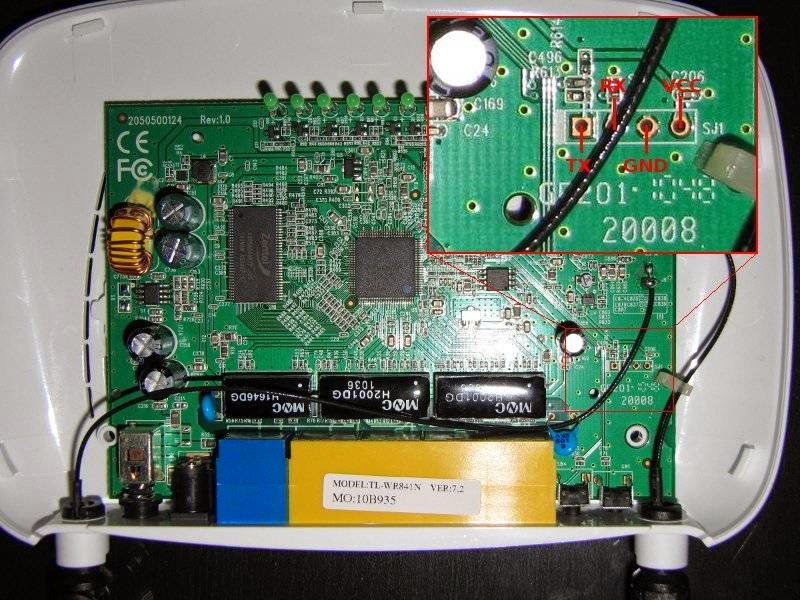

# 使用ttl线复活刷成砖的tp-link wr841n v7无线路由器

wr841n v7被我刷成了砖，当时想从openwrt刷回官方固件，按照网上的命令执行下来就出问题了，重启路由后，所有灯一起闪烁，连接电脑后显示网线没插。

淘宝买了了ttl转usb工具，按照这位兄弟的[帖子](http://zmt.me/post/72.html)一步步来，就可以把wr841n救回来了。

说说自己在这过程中碰到的几个问题吧：

1\. 杜邦线接线顺序，我是wr841n V7，顺序可以参考下图，找高人给焊接了金属棍，这样可以直接使用杜邦线了。  2. 第11步短接了C496后，SecureCRT依然是白屏，没有字符显示，后来重新检查了焊接点和C496好几次，最后发现原因是路由器没插电源 0\_O

3\. 一定要把电脑的防火墙给关了。否则第18步会报错。

4\. 要上传的固件一定要选对，从tplink官网下载的wr841n V7的固件居然不行，网上找了个，需要的可以[下载](https://docs.google.com/file/d/0BxoNo8JWLhQvbkR4Uk1MT3RGeW8/edit)。

