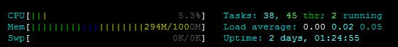

# VULTR VPS配置笔记

购买vultr的VPS差不多一年，用下来还算稳定，开始的大部分时间用来架设SS使用，最近趁着8折，把配置升到了1G内存版本的，放了三个wp在上面，很无奈的是由于MYSQL 5.7.12的bug，vps开机40分钟内存就满了，网上找了一堆优化的文章，设置下来还是不管用，谁知升级到MYSQL 5.7.13后问题自己解决，现在内存使用量稳定在不到300M，很舒坦。

此贴主要记录折腾了几次的**VPS**的设置，主要参考的digitalocean上的文章，这一点上vultr比DO差太多了。关于支付问题，使用的是中信银行的VISA卡，网上就可以申请，很方便。

- 这一步是VPS申请到后的第一步，很简单，可以参考DO的[这篇文章](https://www.digitalocean.com/community/tutorials/initial-server-setup-with-ubuntu-16-04)，前面的关于登陆的一概略过，我还是喜欢还是使用密码登陆（关键使用WIN10系统），后面的关于ufw的配置需要看下，也很简单。
- 第二步就是[安装NGINX, MYSQL, PHP了](https://www.digitalocean.com/community/tutorials/how-to-install-linux-nginx-mysql-php-lemp-stack-in-ubuntu-16-04)。
- 第三步，既然有了**Let’s Encrypt**这个免费的**HTTPS**福利，[用起来吧](https://www.digitalocean.com/community/tutorials/how-to-secure-nginx-with-let-s-encrypt-on-ubuntu-16-04)。
- 添加对**HTTP/2**的[支持](https://www.digitalocean.com/community/tutorials/how-to-set-up-nginx-with-http-2-support-on-ubuntu-16-04)，其实在nginx的网站配置文件中SSL部分添加http2即可，可以使用Chrome插件[HTTP/2 and SPDY indicator](https://chrome.google.com/webstore/detail/http2-and-spdy-indicator/mpbpobfflnpcgagjijhmgnchggcjblin)来检查是否生效，但前提需要翻墙访问你的网站，或者访问[这个网站](https://tools.keycdn.com/http2-test)来检测，貌似也需要翻墙，实在不行，在VPS命令行执行 openssl s\_client -connect www.yourdomain.com:443 -nextprotoneg ‘’来检测。
- 这一步就是解决如何让nginx支持多个网站了，可以直接复制第一个网站的nginx配置文件，将配置文件有关ssl，server\_name及root的配置修改一下，链接到sites-enabled里面，然后重新获取let's encrypt证书即可。注意，新网站的nginx配置文件中listen后的default\_server要去掉，有两处。
- 这一步开始[安装wordpress](https://www.digitalocean.com/community/tutorials/how-to-install-wordpress-with-lemp-on-ubuntu-18-04)了，还有一些安全配置，具体可以参考这篇[文章](http://www.morphatic.com/2016/05/21/super-fast-secure-wordpress-install-on-digitalocean-with-nginx-php7-and-ubuntu-16-04-lts/)，值得细看。
- 愿意安装phpmyadmin的可以看[这里](https://www.digitalocean.com/community/tutorials/how-to-install-and-secure-phpmyadmin-with-nginx-on-an-ubuntu-14-04-server)，文中nginx比较老，将phpmyadmin的目录链接到某网站root下就可以了，比如 ln -s /usr/share/phpmyadmin /var/www/html
- 关于MYSQL的一些优化可以使用这个[脚本](http://mysqltuner.com/)，里面会提一些建议，这个[网站](http://www.speedemy.com/)专门讲解了MYSQL的优化。其中一篇[帖子](http://www.speedemy.com/17-key-mysql-config-file-settings-mysql-5-7-proof/)讲解了影响MYSQL性能的几个重要参数。使用命令mysqladmin -u root -p variables >> log可以查看你VPS上MYSQL的参数配置情况。
- 网上还有一个MYSQL的内存占用[计算器](http://www.mysqlcalculator.com/)，貌似[不准](http://mingxinglai.com/cn/2016/04/mysql-memory-usage-formula/)。但可以看出影响MYSQL性能的参数有哪些。

目前就是这些了，关键是MYSQL最新版本不耗内存，还是使用了MYSQL。

