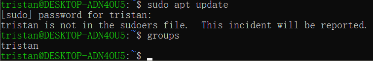
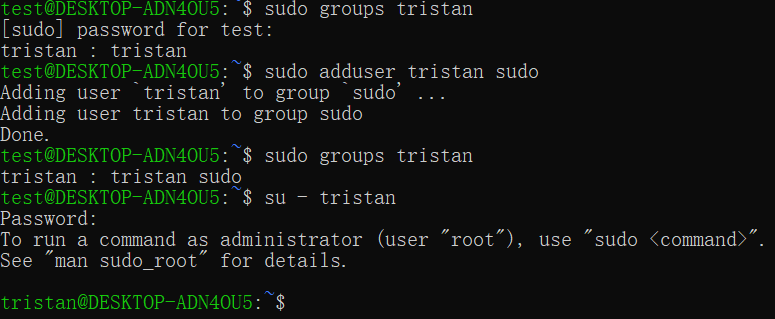
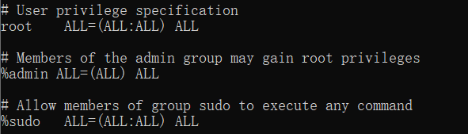
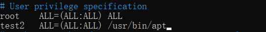
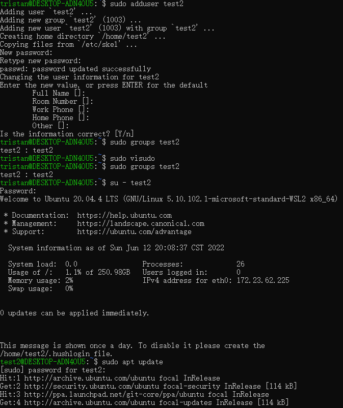
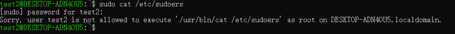
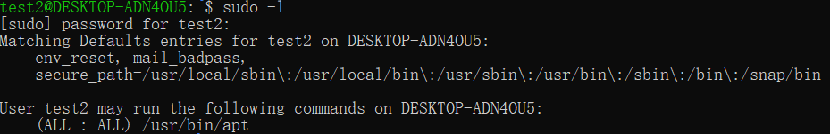

# What Is Sudo



本文环境基于Ubuntu20.04系统


既然本站域名包含sudo，那么大家就一起了解下sudo这个命令吧。

sudo这个程序，是由 Bob Coggeshall 和 Cliff Spencer 在上世纪80年左右在一台运行4.1 BSD的机器VAX-11/750上实现的。在随后的岁月中，逐渐[演变](https://gratisoft.us/sudo/history.html)成了现在的样子。

首先，当你安装Ubuntu的桌面版或者服务器版本的过程中，系统会让用户输入一个用户名以及密码（很多VPS默认使用root用户），而用户输入的用户名不能是root，这是因为Ubuntu系统中root用户是自带的，并且在你安装好系统后，root用户默认是非激活状态，这也就是有些人在刚装好系统后不知道我的**root用户默认密码**是多少的原因。

如果实在想激活root用户，执行 ```sudo -i``` ，然后执行 ```passwd``` 设置个密码就激活了root用户。

如果后悔了，可以运行 ```sudo passwd -dl root``` 就可以disable root用户了。运行 ```su``` 会发现，进不去root用户。

那么如何使用root的权限来执行命令呢？sudo可以解决这个问题。其实当你进入刚刚安装好的系统后，Ubuntu默认将你创建的用户加入到了sudo用户组，也就是拥有了root的所有权限。
## 1. 举个栗子
我们通过个例子来说一下，在我的机器上已经有一个叫 ```test``` 的用户，并且在sudo组当中，所以test用户可以执行root的所有可执行的命令。
### 1.1 创建用户
首先在机器上先添加一个叫tristan的用户，执行 ```sudo adduser tristan``` ,输入密码后一路回车，然后执行 ```su - tristan``` 来切换到刚刚创建的用户tristan，接着执行 ```sudo apt update``` ，可以看到，新创建的tristan用户是无法使用root权限的，因为不在sudo用户组当中，执行```groups```可以看到tristan仅仅在tristan这个用户组当中。


### 1.2 拉人入伙
此时，切换回有sudo权限的用户 ```su - test```，执行 ```sudo groups tristan``` ，可以看到tristan只在他自己的组当中，然后执行 ```sudo adduser tristan sudo``` 或者 ```sudo usermod -aG sudo tristan``` 来将tristan这个用户加入到sudo组当中，再次执行 ```sudo groups tristan``` ，可以看到tristan这个用户已经被加入到了sudo组中，拥有了root权限。


### 1.3 sudoers介绍
而sudo组有哪些权限呢？执行 ```sudo cat /etc/sudoers``` 可以看到下面的内容



第一印象是，怎么这么多ALL？

- 第一个ALL可以理解为代表本机，括号里的第一个ALL代表所有用户，冒号后面的ALL代表所有组，括号后面的ALL代表所有命令。

-  ```root``` 开头的这行的意思是，root用户可以执行**本机**上**所有**群组里面**所有**用户可以执行的**所有**命令。

- ```%admin``` 中%代表群组，这样的意思就是 ```admin``` 这个组的用户可以执行所有命令。

- 最关键的是 ```%sudo``` 这行，意思和 ```%admin``` 这行一样，可以执行所有权限。

那么为什么既然有了 ```admin``` 这个组，还会有 ```sudo```这个组呢？这个是ubuntu的历史遗留问题，根据Ubuntu 12.04 LTS的[release note](https://wiki.ubuntu.com/PrecisePangolin/ReleaseNotes/UbuntuDesktop#PrecisePangolin.2FReleaseNotes.2FCommonInfrastructure.Common_Infrastructure)中，说在Ubuntu 11.10之前，一直使用的admin这个组，但是从12.04开始使用sudo这个组了。包括 ```%admin``` 这行的写法和其他行不一样，应该也是同样的原因。好像Debian中从未有过 ```admin``` 这个组，一直都是 ```sudo``` 这个组，并且Debian系统中root用户是默认激活的。
### 1.4 还是栗子
知道了 ```/etc/sudoers``` 这个文件，就可以解决下面的问题了，如果只想给某个用户分配部分只能root权限执行的程序，只需要在root这样下面加上用户名和想赋予执行程序的路径就可以了。编辑这个文件时，最好使用 ```visudo``` 命令，这个工具可以避免多人同时编辑sudoers文件，并且带有语法检查功能。

比如，我们在机器上添加 ```test2``` 这个用户，如何在不把他加入sudo组的前提下执行sudo apt update命令呢？

```shell
sudo adduser test2
sudo groups test2  #查看test2用户的群组
sudo visudo
```
在root这行下面加入一行
```int
test2   ALL=(ALL:ALL) /usr/bin/apt
```


保存退出，然后切换到新创建的 ```test2``` 用户，``` su - test2``` ，就可以执行 ```apt update```命令了，运行 ```groups``` 命令可以发现，```test2``` 用户不在sudo组当中，所以无法执行 ```apt update``` 命令。



试着执行下其他root命令：



可以看到，没有权限。

可以执行 ```sudo -l``` 查看当前用户都可以执行哪些root才能执行的命令



如果你觉得执行需要输入密码比较麻烦的话，可以将sudoers里面的写成下面这样：

```
test2   ALL=(ALL:ALL) NOPASSWD: /usr/bin/apt
```

## 2. sudo存在的意义

既然用户可以添加sudo来执行root才能执行的命令，那么sudo存在的意义是什么呢？其实，包括我在内，尤其是在VPS上时候，都是直接root登录的。
### 2.1 优点
使用sudo而不直接使用root用户的优点有下面几个

- 不用单独再记住root的密码，哪怕root用户默认没有激活也可以。
- 网络上那些频繁尝试通过暴力破解登录你VPS的人只知道root这个用户一定存在，而不知道你有sudo权限的用户名是什么，就像Ubuntu这样默认禁止root用户的情况下，有人想暴力破解你VPS的密码，还必须知道你的用户名是什么，这样概率会小很多很多。
- 当删除用户时方便，直接删除有sudo权限的用户即可，如果直接使用root用户，还得修改root密码，这样给其他人造成不便。
- 可以赋予某个用户执行部分sudo程序的权限，就像上面例子展示的一样。
- 每个用户可以根据自己习惯修改自己的配置文件，比如vi等很多软件，如果都使用root，会造成不便。

### 2.2 缺点
- 命令行提示符前面的名称不是root，看着不爽啊。
- 运行sudo需要经常输入密码，也不爽。尽管可以在/etc/sudoers文件中设置下不输入密码。
- 运行命令时经常忘记打sudo，这时候可以使用 ```sudo !!```而不用按上箭头，再在命令行前面加sudo了。 

### 2.3 习惯养成
就VPS而言，这样做更安全：
- ssh配置文件中屏蔽root登录
- Ubuntu中再将root用户设为非激活状态
- 屏蔽密码登录，只允许证书登录
- 证书必须加密，否则证书万一被其他人知道了，麻烦就到了。

更多关于sudo的可以看man.




