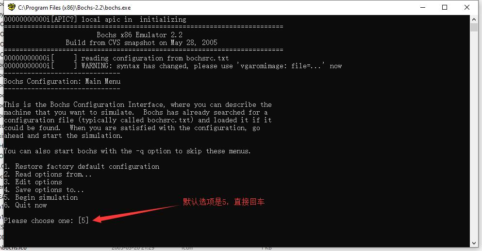
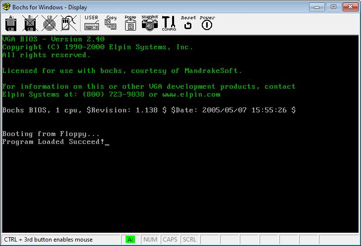

# 自己写一个简单的引导程序


学习操作系统应该多动手 操作过程在xp下进行。

```nasm
;;;;;;;;;;;;;;;;;;;;;;;;文件名boot.asm;;;;;;;;;;;;;;;;;;;;;;;;;;;;;;

[ORG 0] jmp 07C0h:start

start:

mov ax,cs mov ds,ax mov es,ax

reset: mov ax,0 mov dl,0 int 13h jc reset

read: mov ax,1000h mov es,ax mov bx,0

mov ah,2 mov al,5 mov ch,0 mov cl,2 mov dh,0 mov dl,0 int 13h

jc read

jmp 1000h:0000

times 510-($-$$) db 0 dw 0AA55h 
;;;;;;;;;;;;;;;;;;;;;;;;;;;;;;以上是boot.asm内容;;;;;;;;;;;;;;;;;;;;;;;;;;
```

```nasm
;;;;;;;;;;;;;;;;;;;;;;;;;;;;;prog.asm;;;;;;;;;;;;;;;;;;;;;;;;;;;;;;;;;;;;;;;;;; 

[ORG 0] jmp start2

msg db ‘Program Loaded Succeed!Hello, LinuxRen!’,$0

start2: mov ax,cs mov ds,ax mov es,ax

mov si,msg

print: lodsb cmp al,0 je hang

mov ah,0Eh mov bx,7 int 10h

jmp print

hang: jmp hang

times 510-($-$$) db 0 dw 0AA55h 
;;;;;;;;;;;;;;;;;;;;;;;;;;以上是prog.asm内容;;;;;;;;;;;;;;;;;;;;;;;;;;;;;;;
```

保存好这两个文件，然后在本站下载bochs和nasmw以及partcopy.

安装，然后进入到bochs的目录，建立一个bochsrc.txt文件，内容如下

```asm
megs:4 romimage:file=$BXSHARE/BIOS-bochs-latest,address=0xf0000 vgaromimage: $BXSHARE/VGABIOS-elpin-2.40

floppya:1\_44=FLOPPY.IMG, status=inserted

boot:a

log:bochsout.txt
```

ok,快完了，再忍忍

然后使用下面的命令将上面的两个.asm文件编译 nasm boot.asm -o boot.bin nasm prog.asm -o prog.bin 会产生两个.bin文件

然后使用partcopy创建img文件，命令如下： partcopy boot.bin 0 200 floppy.img 0 partcopy prog.bin 0 200 floppy.img 200 会生成一个.img文件

将bochsrc.txt放到boch根目录下面，还有刚才的floopy.img文件，然后打开boch.exe按回车



会弹出一个下面的窗口，表明启动成功



OK, Done! 本站所使用工具[下载](https://drive.google.com/file/d/1nPua42rwL_ZUrBRP2qZYEqYDH6VMzLcM/view?usp=sharing)。

