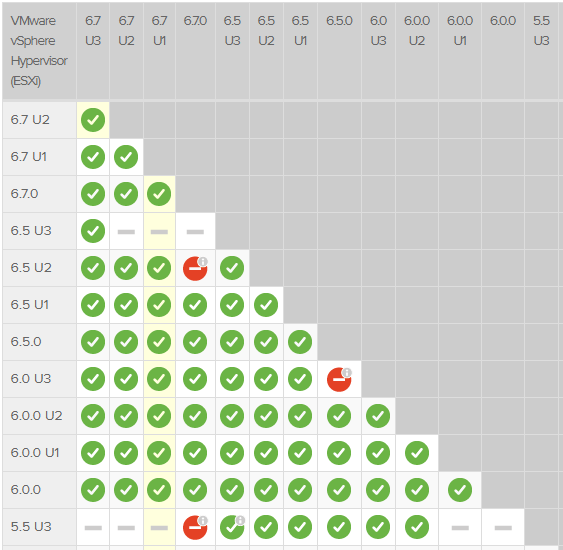
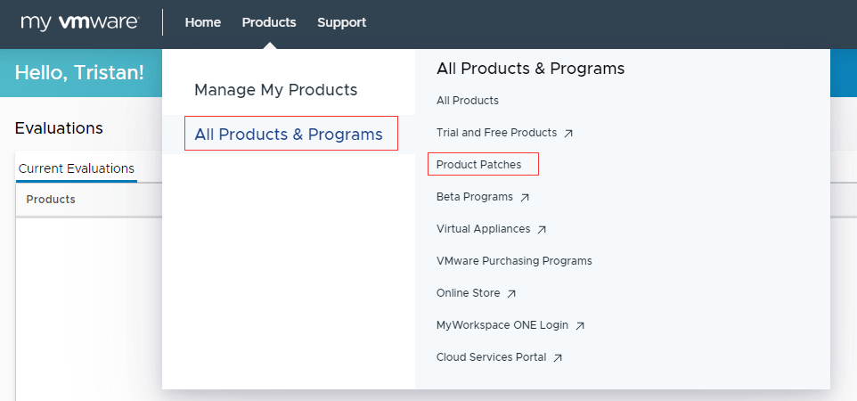
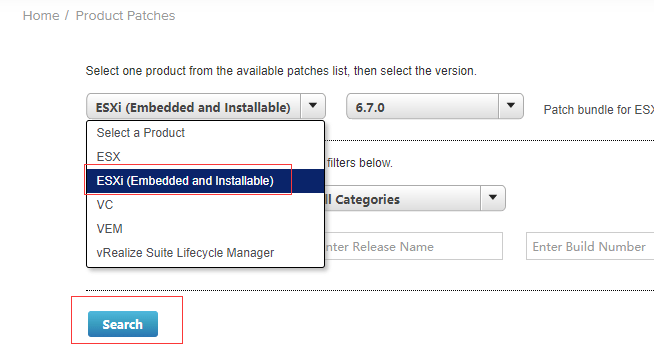
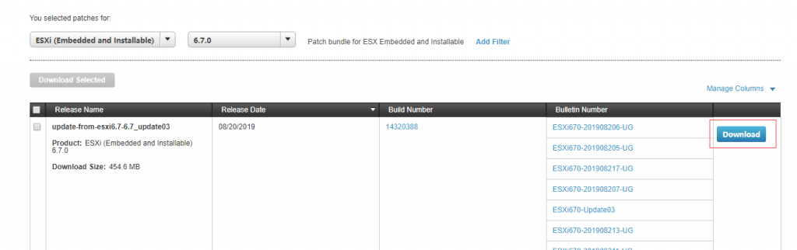
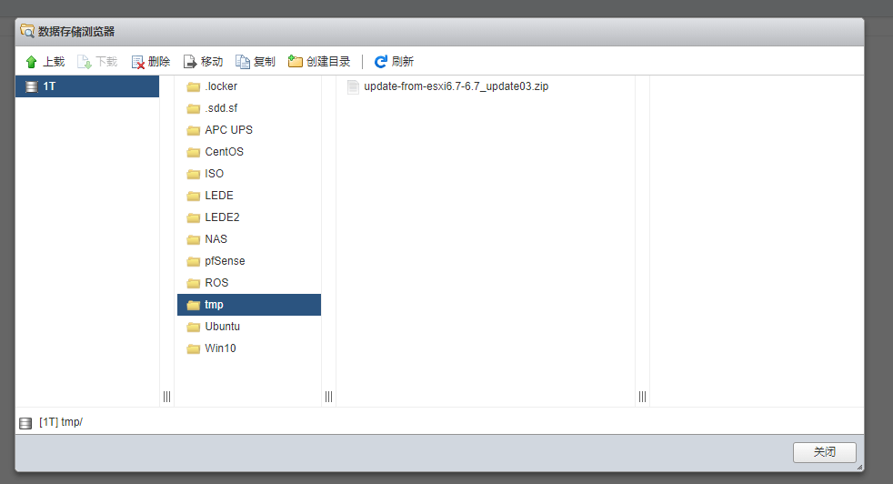
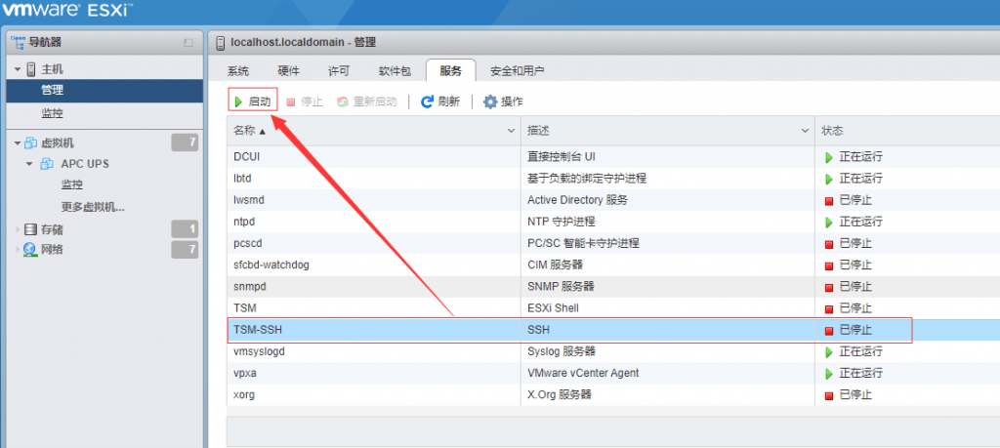
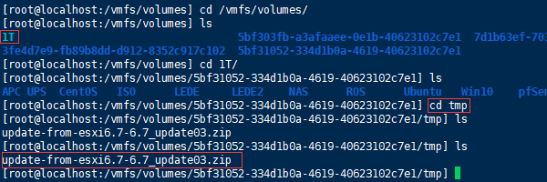
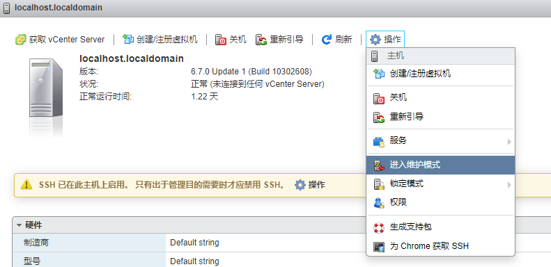
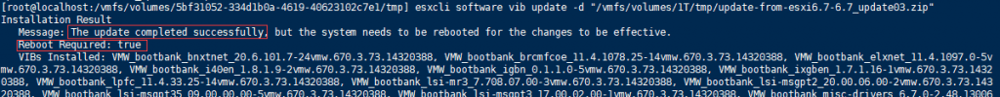
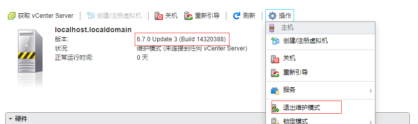

# 升级ESXI到最新的6.7 U3版本


目前使用的esxi版本是差不多一年前的版本，前段时间esxi出了6.7 Update3，关于u3版本的新特征，可以看[这里](https://docs.vmware.com/cn/VMware-vSphere/6.7/rn/vsphere-esxi-67u3-release-notes.html)，貌似CPU利用率有提升？所以打算升级下，网上搜索了下文章，很容易。现在将升级过程罗列如下：

[](https://lijie.org/wp-content/uploads/2019/10/01-1.png)

VMware[官方文档指出](https://www.vmware.com/resources/compatibility/sim/interop_matrix.php#upgrade&solution=1)，想升级到esxi 6.7 u3，目前你使用的esxi最低版本必须是6.0，低于此版本的必须先升级到6.0，然后再升级到6.7 u3。  
you can [only](https://www.vmware.com/resources/compatibility/sim/interop_matrix.php#upgrade&solution=1) upgrade esxi to 6.7 u3 if the esxi you're running is 6.0 or above. Anything older than 6.0, you'll need to upgrade to 6.0 first, and then do a second upgrade to 6.7 u3.

打开[https://my.vmware.com](https://my.vmware.com)，登陆，下载最新版本的esxi。

Before you start, take a look at esxi 6.7 update 3 [new fetures](https://docs.vmware.com/en/VMware-vSphere/6.7/rn/vsphere-esxi-67u3-release-notes.html). Navigate to [https://my.vmware.com](https://my.vmware.com), log in with your account, and download the latest version of esxi.

[](https://lijie.org/wp-content/uploads/2019/10/01.png)

选择上面的红框标注的位置 chose and click the marked link

[](https://lijie.org/wp-content/uploads/2019/10/02.png)

选择esxi 然后点击下面的search, choose esxi and then search

[](https://lijie.org/wp-content/uploads/2019/10/03.png)

找到最新版本 下载 find and download the latest version

[](https://lijie.org/wp-content/uploads/2019/10/04.png)

将下载的安装包上传到esxi后台 upload the esxi package to esxi storage

[](https://lijie.org/wp-content/uploads/2019/10/05.png)

打开esxi的SSH权限 enable the esxi ssh

[](https://lijie.org/wp-content/uploads/2019/10/06.png)

使用ssh工具登陆esxi后台 找到升级包存放的位置 connect esxi through SSH and locate the package you just uploaded

[](https://lijie.org/wp-content/uploads/2019/10/07.png)

将esxi设为维护模式 之前需要关闭所有的虚拟机电源 put the esxi into maintenance mode, poweroff all your VMs before you do that

运行的命令为：```esxcli software vib update -d``` "升级包的路径及文件名"， 可以按tab键补齐

我这里的命令是： ```esxcli software vib update -d "/vmfs/volumes/1T/tmp/update-from-esxi6.7-6.7_update03.zip"```

issue the command above, change the path of your esxi package accordingly

[](https://lijie.org/wp-content/uploads/2019/10/08.png)

运行命令 几分钟后会有结果提示升级成功 然后reboot机器  
2 or 3 minutes later, the update should completed successfully, then reboot.

[](https://lijie.org/wp-content/uploads/2019/10/09.png)

重启完成后，退出维护模式，可以看到esxi版本号已经是最新的了  
after the reboot completed, log into esxi, quit the maintenance mode, and you'll noticed the version number has changed to the newest.

以上。改天再升级下vcenter，以及如何从vcenter升级esxi。

