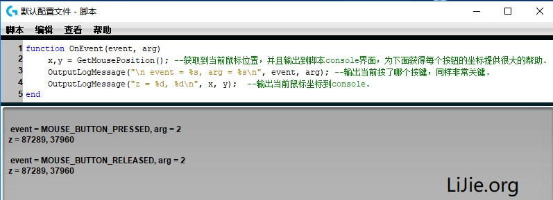

# 暗黑破坏神3 一键切换巅峰鼠标宏代码详解


使用罗技的**鼠标宏**实现在**暗黑3**中一**键切换巅峰**的功能，注释很详细了。实例始用**野蛮人**，一般来说组队**死灵法师**需要这样的功能。

需要注意的是，下面最终代码里面的鼠标坐标仅仅适用于我的显示器，至于大家的显示器在游戏中的按钮的坐标，大家可以在将鼠标移动到按钮上后，执行下面代码，看罗技鼠标console输出的数值就是你的坐标了。同时显示的还有你当前按键的编号(实例输出结果arg = 2，也就是你目前按的键在代码里对应的是2这个数字)，也很关键。**确定坐标和你想使用的快捷键的在程序宏中对应的编码很关键！**
```java
function OnEvent(event, arg)
	x,y = GetMousePosition(); // 获取到当前鼠标位置，并且输出到脚本console界面，为下面获得每个按钮的坐标提供很大的帮助.
	OutputLogMessage("event = %s, arg = %s\n", event, arg); // 输出当前按了哪个按键，同样非常关键.
	OutputLogMessage("z = %d, %d\n", x, y);  // 输出当前鼠标坐标到console.
end
```
执行上面的代码，可以看到目前按键信息以及坐标信息，如下图：



正式代码如下：
```java
// 本脚本以野蛮人作为测试，始用罗技G610键盘为例(鼠标同理)说明。实现按键盘的F5键将力量加满，体能为0；
// 按F6键将体能加满，力量为0.(此功能未实现，大家可以自己试试看)
function OnEvent(event, arg)
	// 此if语句判断是否按了F5，是的话加满力量,体能设为0.
	if(event == "G_PRESSED" and arg == 5) then // 这里的5就是键盘上的f5，如果是鼠标，并且不清楚按键arg参数具体是多少，
                                                   // 可以将此处的if语句去除，看罗技console界面输出的结果.

		x,y = GetMousePosition(); // 获取到当前鼠标位置，并且输出到脚本console界面，
                                          // 为下面获得每个按钮的坐标提供很大的帮助.
		OutputLogMessage("event = %s, arg = %s\n", event, arg); // 输出当前按了哪个按键，同样非常关键.
		OutputLogMessage("z = %d, %d\n", x, y);  // 输出当前鼠标坐标到console.

		PressKey("p");  // 按P键，打开巅峰点面板.
		ReleaseKey("p");
		Sleep(5);

		MoveMouseTo(33160,44399);  // 将鼠标移动到重置按钮处.这些坐标适用于我的显示器，你的显示器具体坐标还需要看上面的输出.
		PressAndReleaseMouseButton(1); // 点击重置按钮，重置所有巅峰点.

		// 以下加移速. 装备上的移速来决定巅峰加多少移速点，我这里加了28点，也就是巅峰加了14%的移速.
		Sleep(5);
		MoveMouseTo(43815,31826);// 将鼠标移动到加移速的按钮处.
		for i = 0, 27, 1 do
			Sleep(2);
			PressAndReleaseMouseButton(1);
		end
		// 以上加移速

		// 以下加满怒气
		MoveMouseTo(43576,36746); // 将鼠标移动到加怒气的按钮处.
		PressKey("lCtrl"); // 按左ctrl键
		PressAndReleaseMouseButton(1);  // 按左ctrl的时候，按一下左键即可加满怒气.
		Sleep(2);
		ReleaseKey("lCtrl");
		// 以上加满怒气

		// 以下加满力量
		MoveMouseTo(43679,20468); // 移动到力量按钮处.
		PressKey("lCtrl");
		for i = 0, 40, 1 do  // 按住ctrl键的清况下点击力量按钮40下，相当于4000力量.
			Sleep(2);
			PressAndReleaseMouseButton(1);
		end
		ReleaseKey("lCtrl");
		// 以上加满力量

		// 设置完毕后，按接受按钮.
		MoveMouseTo(28652,49440);
		PressAndReleaseMouseButton(1);
	end
end
```
以上。

