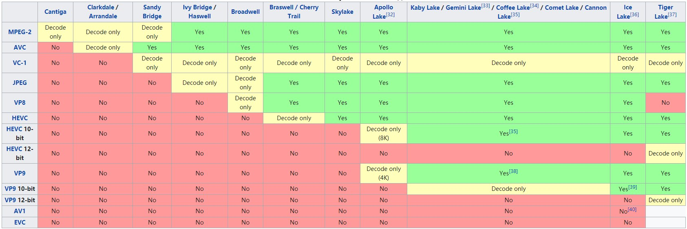
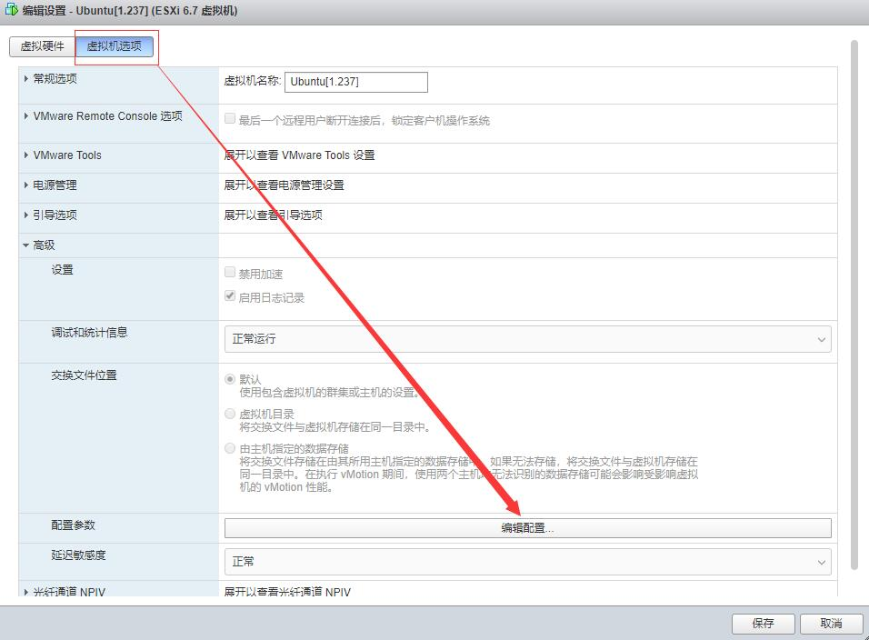
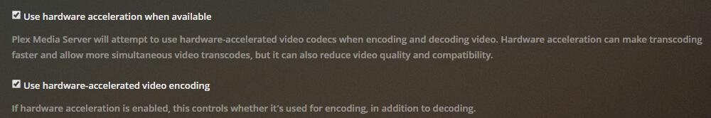
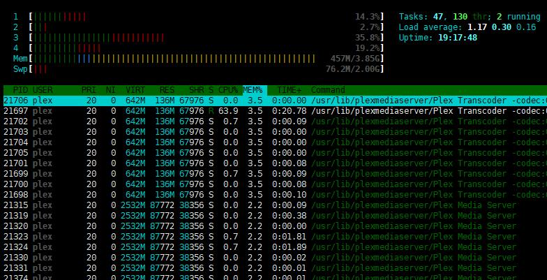
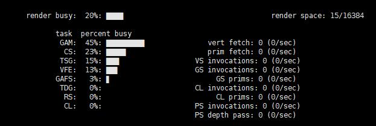
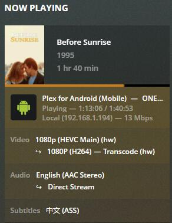
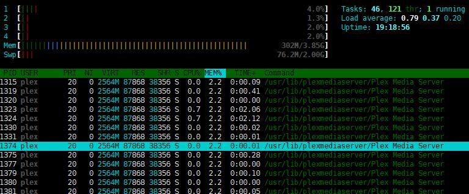
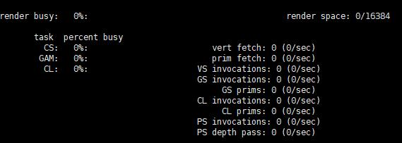
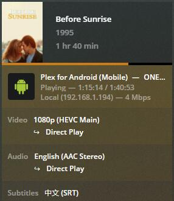

# 降低CPU使用率 让Plex客户端解码

## 1. 硬件介绍
**Plex**给人的印象是需要服务器端**转码**，这给很多人造成了错误的印象，前几天入手了终身Plex Pass，随即折腾起来，发现Plex完全可以像Kodi一样使用客户端解码，降低服务器端的**CPU占用率**，加上Plex本身漂亮的UI界面和强大的数据刮削能力，Plex在**Emby**(收费), **Jellyfin**(全免费), 和**Kodi**(全免费，太丑，弃)的竞争中，完全不落下风。

我的硬件：一台小的Home Box，配置是**i3-7100u(Intel Kaby Lake)**, 8G内存。一台家用NAS，**QNAP** **NAS** 453B mini一台，10G内存, 处理器是**J3455(Intel Apollo Lake)**, 8G内存。

处理器是i3-7100的Home Box安装了**Esxi**，上面安装了**Openwrt**和Ubuntu server（ubuntu里又装了Plex服务器端）以及其它系统。也就是所说的**软路由**中安装Plex服务器。

**Ubuntu server**和QNAP上都安装了**Plex server**，这里使用Ubuntu中的Plex server来测试，NAS仅仅作为一个存储设备。

i3-7100U的核显是**HD 620**, 而QNAP NAS的处理器是J3455，**核显**是**HD 500**。两款核显均支持4K分辨率下H.264的转码**transcoding**（包括**解码decoding**和**编码encoding**），而对于, **H.265**(HEVC)编码，只有HD620的也就是7100u支持转码，J3455仅仅支持解码（支持播放）。具体**核显的**性能区别可以看[这里](https://bluesky-soft.com/en/dxvac/deviceInfo/decoder_intel.html)以及[这里](https://en.wikipedia.org/wiki/Intel_Quick_Sync_Video#Hardware_decoding_and_encoding)。所以不论是自己组件NAS还是购买现成的NAS，CPU是非常关键的，CPU越新，核显越新，才能更大幅度的降低CPU的使用率。
<!--  -->


## 2.开始
### 2.1 软路由Ubuntu系统挂载NAS硬盘
首先在Ubuntu中挂载NAS中共享的电影文件夹：
```shell
apt install nfs-common #安装nfs
showmount -e 192.168.1.99 #看下nas哪些目录是共享可挂载的。
mkdir /mnt/qnap #在ubuntu中创建文件夹qnap，用来挂在qnap的共享文件夹
mount 192.168.1.99:/电影共享 /mnt/qnap #将nas共享的电影共享目录挂在到linux的qnap目录上。
apt install ffmpeg intel-gpu-tools #安装解码器和查看intel显卡占用率程序
```
### 2.2 显卡直通设置










随后安装Plex的Ubuntu服务器端和手机或者PC的客户端，此处略过...，需要注意的是，媒体文件夹选择刚才挂载的NAS文件夹即可。
## 3. 开始测试
 

首先进入Plex服务器后台(我这里的地址http://192.168.1.237:32400/)，点击transcoder，确保下面两个选择框都勾选
### 3.1 ass字幕
播放H.265的影片，默认使用ass字幕，服务器端资源占用率如下：

 

运行htop，cpu占用率情况，可以看到plex的transcoder在工作

 

运行intel_gpu_top，可以看到核显也在工作

 

Plex后台也可以看到Plex在硬件转码(HW)，字幕显示ASS格式

### 3.2 更换为srt字幕
我下载的影片内嵌了srt的字幕，在播放终端手动将字幕设为srt字幕后的情况：

 

CPU占用率明显下降，并且plex的transcoder没有工作

 

核显没有任何负载

 

Plex后台显示Direct Play，意思就是后台没有进行任何的转码，字幕是SRT

## 4. 总结
所以以我目前的播放终端来看，能更进一步降低CPU占用率的很简单的办法就是更换字幕格式，实际测试发现SRT和**PGS（pgs字幕还带有各种特效和字体，居然不转码？！很奇怪）**以及SSA格式的字幕均不会转码，很不起眼的原因。如果必须服务器端解码的时候，这就考验服务器端CPU的核显了，牙膏厂的7系列及以后的cpu的核显(620及以后的可以)可以承担很多工作，这样CPU使用率会低很多。

音频有时候也会转码，但是cpu的使用率却非常低，所以不考虑了。

下一步研究下免费的Jellyfin，毕竟是免费的，并且是从收费的Emby脱离出来的。

